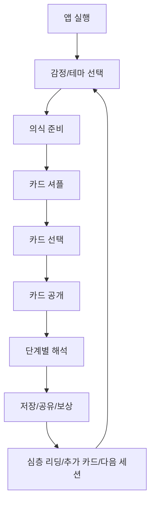
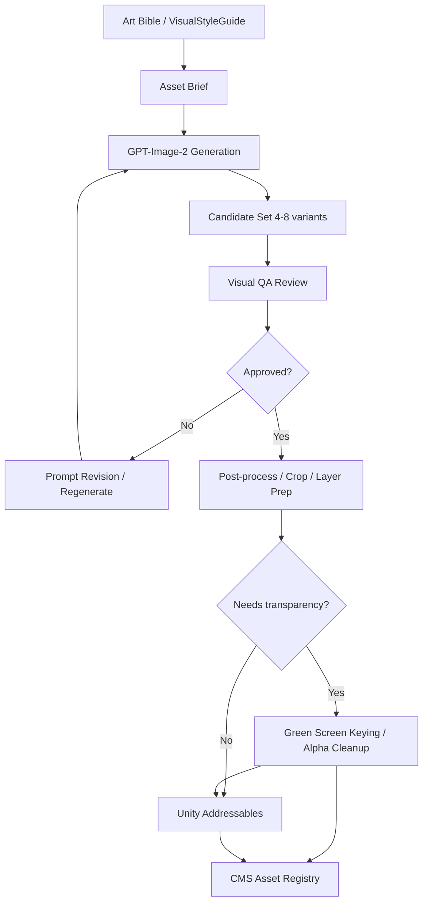
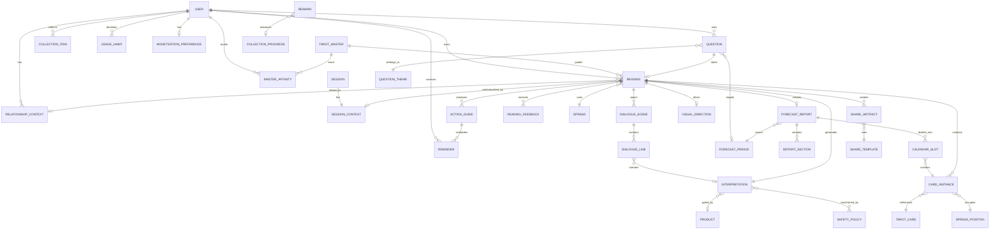
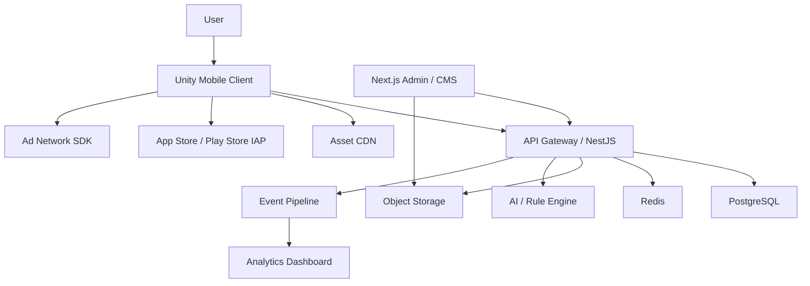
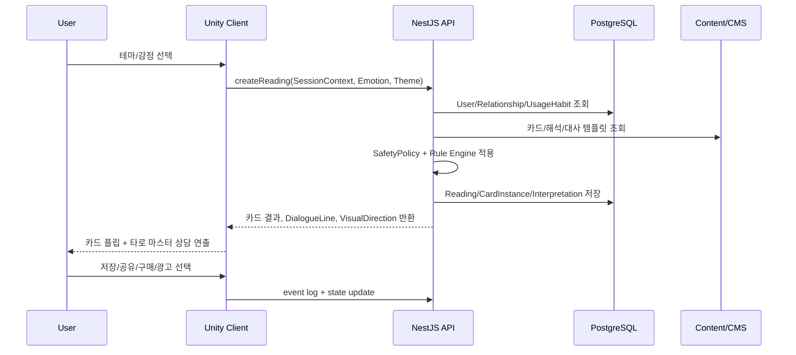

# ARCANUM STAGE PRD

문서 버전: v0.1  
작성일: 2026-05-18  
제품 유형: 100% 그래픽 기반 모바일 타로 앱  
핵심 장르: 타로 + 인터랙티브 의식 + 감정형 캐주얼 게임  
주요 시장: 한국 모바일 사용자, 20~40대 여성 중심, 연애/재회/상대 마음 고관여층

---

## 1. 제품 개요

### 1.1 제품 한 줄 정의

**ARCANUM STAGE는 사용자가 직접 카드를 섞고, 고르고, 뒤집으며 자신의 고민을 하나의 화려한 그래픽 의식으로 경험하는 게임형 타로 앱이다.**

### 1.2 제품 포지셔닝

기존 타로 앱은 보통 `카드 이미지 + 해석 텍스트` 구조에 머문다. ARCANUM STAGE는 이를 `리딩 세션 = 무대형 플레이`로 바꾼다.

사용자는 상담창에서 질문을 기다리는 사람이 아니라, 운명의 무대에 입장해 직접 의식을 진행하는 플레이어가 된다. 카드 셔플, 선택, 공개, 해석, 저장, 공유, 과금까지 모든 핵심 행동은 그래픽 오브젝트와 애니메이션으로 표현된다.

### 1.3 핵심 차별점

| 구분 | 일반 타로 앱 | ARCANUM STAGE |
|---|---|---|
| 사용 경험 | 텍스트 상담, 카드 뽑기 | 그래픽 의식, 카드 조작, 무대 연출 |
| 결과 전달 | 긴 문장 중심 | 카드, 상징, 자막, 단계적 해석 |
| 대중성 | 타로 지식 필요 | 질문 유형 선택만으로 사용 가능 |
| 반복 사용 | 운세 확인 | 매일 의식, 카드 수집, 관계 리포트 |
| 수익화 | 단건 상담/광고 | 프리미엄 리딩, 카드팩, 스킨, 구독 |
| 공유성 | 텍스트 캡처 | 세로형 결과 이미지/짧은 영상 |

### 1.4 시장 가설

2026년 기준 점성/타로/스피리추얼 앱 시장은 AI 개인화, 게임화, 프리미엄 구독, 감정 케어형 사용 경험이 강한 성장 신호로 관찰된다. 특히 한국 시장은 사주, 운세, 타로, 연애 상담 콘텐츠에 대한 문화적 진입 장벽이 낮다.

본 제품의 가장 강한 수요는 `상대의 마음`, `재회 가능성`, `오늘 연락 올까`, `A/B 선택`처럼 사용자의 감정적 불확실성을 빠르게 건드리는 주제에서 발생한다.

---

## 2. 목표 사용자

### 2.1 Primary Persona

| 항목 | 내용 |
|---|---|
| 이름 | 불안한 연애 탐색자 |
| 나이 | 20~34세 |
| 상황 | 썸, 연애, 이별 후 재회, 연락 대기 |
| 욕구 | 상대의 진심을 알고 싶다. 지금 연락해도 되는지 알고 싶다. 내 선택이 맞는지 확인받고 싶다. |
| 사용 시간 | 밤 10시~새벽 2시, 출근길, 잠들기 전 |
| 결제 가능 순간 | 결과가 애매할 때, 상대 심리/연락 타이밍을 더 보고 싶을 때 |
| 선호 UX | 빠른 진입, 예쁜 화면, 직관적 조작, 공유 가능한 결과 |

### 2.2 Secondary Persona

| 항목 | 내용 |
|---|---|
| 이름 | 매일 운세 루틴 사용자 |
| 나이 | 25~45세 |
| 상황 | 매일 아침/저녁 가볍게 운세 확인 |
| 욕구 | 오늘의 분위기, 조심할 점, 행운의 시간대를 알고 싶다. |
| 사용 시간 | 오전 7~9시, 점심시간, 퇴근 후 |
| 결제 가능 순간 | 주간/월간 리포트, 카드 도감, 광고 제거 |
| 선호 UX | 반복 보상, 기록, 캘린더, 예쁜 결과 카드 |

### 2.3 Tertiary Persona

| 항목 | 내용 |
|---|---|
| 이름 | 비주얼 수집형 사용자 |
| 나이 | 18~35세 |
| 상황 | 타로 자체보다 카드 아트, 테마, 분위기에 끌림 |
| 욕구 | 예쁜 카드덱과 연출을 모으고 싶다. 결과 이미지를 저장하고 싶다. |
| 결제 가능 순간 | 한정 카드덱, 배경 스킨, 공유 프레임 |

---

## 3. 제품 목표

### 3.1 사용자 목표

- 질문을 길게 입력하지 않아도 원하는 고민 리딩에 즉시 진입한다.
- 카드를 직접 조작하면서 실제로 내가 뽑았다는 감각을 얻는다.
- 결과를 어렵지 않은 현실 언어로 이해한다.
- 결과를 저장하거나 예쁜 이미지로 공유한다.
- 반복 리딩을 통해 내 감정과 관계 흐름을 시각적으로 확인한다.

### 3.2 비즈니스 목표

- 매일 무료 리딩으로 사용 습관을 만든다.
- 연애/재회/상대 마음 주제에서 프리미엄 리딩 전환을 만든다.
- 카드덱, 연출 스킨, 공유 프레임으로 시각적 과금 명분을 만든다.
- 리딩 기록과 관계 리포트로 구독 유지율을 높인다.

### 3.3 제품 원칙

| 원칙 | 설명 |
|---|---|
| 그래픽 우선 | 모든 핵심 기능은 텍스트 메뉴보다 시각 오브젝트와 애니메이션으로 먼저 표현한다. |
| 짧고 강한 세션 | 핵심 리딩은 1~3분 안에 완료되어야 한다. |
| 감정 중심 | 사용자의 질문보다 현재 감정이 리딩 톤, 색상, 연출을 결정한다. |
| 현실 언어 | 카드 전문 용어보다 사용자의 실제 상황에 가까운 문장으로 해석한다. |
| 조작감 | 셔플, 선택, 공개는 사용자가 직접 했다는 감각을 줘야 한다. |
| 과금의 서사화 | 결제는 버튼이 아니라 잠긴 해석, 열쇠, 봉인 해제 같은 세계관 오브젝트로 표현한다. |

---

## 4. 핵심 사용 시나리오

### 4.1 상대의 마음 확인

사용자는 썸 또는 연애 중인 상대의 태도가 애매하다고 느끼고 앱을 실행한다. 홈 화면에서 `지금 그 사람의 진짜 마음` 리딩을 선택한다.

화면은 밤하늘, 촛불, 붉은 실, 안개 낀 거울이 있는 무대로 전환된다. 사용자는 화면 중앙의 붉은 실을 손가락으로 연결한 뒤 카드를 셔플한다. 3장의 카드가 `겉마음`, `속마음`, `다음 행동` 슬롯에 배치된다.

무료 결과에서는 핵심 키워드와 한 줄 요약을 제공한다. 이후 `상대가 말하지 못한 진심 보기`, `연락 가능성 보기`, `내가 지금 하면 안 되는 행동 보기`가 프리미엄 CTA로 열린다.

### 4.2 재회 가능성 확인

사용자는 이별 후 상대가 다시 돌아올 가능성을 알고 싶어 앱을 실행한다. `재회 가능성` 테마를 선택하면 앱은 선택형 질문을 받는다.

| 질문 | 선택지 |
|---|---|
| 마지막 연락은 언제였나 | 오늘/1주 이내/1개월 이내/3개월 이상 |
| 이별 원인은 무엇에 가까운가 | 다툼/권태/거리/상대 변심/내 실수/모름 |
| 현재 연락 상태 | 연락 중/읽씹/차단/아예 없음 |

결과 화면은 단순 확률 대신 `관계 온도`, `상대 후회 지수`, `연락 가능성`, `재회 방해 요인`, `내가 취할 행동`으로 나눠 보여준다.

### 4.3 오늘의 카드 반복 사용

사용자는 하루 1회 무료로 `오늘의 카드`를 뽑는다. 결과는 다음 요소로 구성된다.

| 요소 | 예시 |
|---|---|
| 오늘의 키워드 | 흔들림 속의 기회 |
| 조심할 점 | 먼저 확인하지 않은 추측 |
| 행운 시간 | 19:00~21:00 |
| 행운 행동 | 답장을 서두르지 말고 한 번 더 읽기 |
| 보상 | 별가루, 카드 조각, 도감 경험치 |

### 4.4 선택 A/B 리딩

사용자는 `A를 할까, B를 할까` 같은 선택 상황에서 두 개의 문을 본다. 각 문은 다른 색과 상징으로 표현된다. 카드를 뽑으면 `A의 가까운 결과`, `B의 가까운 결과`, `숨은 리스크`, `후회 가능성`, `지금의 조언`을 시각적으로 비교한다.

### 4.5 연간운세: 12문 운명의 지도

사용자는 새해, 연말, 생일 전후에 `2026 운명의 지도` 또는 `생일 1년 리딩`을 선택한다. 화면에는 12개의 문이 원형 별자리판처럼 배치되고, 중앙에는 `올해의 대표 카드`가 놓인다.

무료 미리보기에서는 대표 카드 1장, 올해의 키워드 3개, 가장 좋은 달 1개, 조심할 달 1개만 공개된다. 프리미엄 해금 시 1월~12월 CalendarSlot이 모두 열리고, 각 달의 카드, 기회, 주의점, 연애/돈/일 흐름, 행동 가이드를 확인할 수 있다.

공유 결과물은 `올해의 카드 포스터`와 `12개월 운세 지도` 두 종류로 생성된다. 민감한 질문 원문 없이 연도, 대표 카드, 핵심 문장만 담아 SNS 공유가 가능하게 한다.

### 4.6 타로 마스터 상담

사용자는 리딩 중 좌측에 크게 등장하는 `타로 마스터`와 대화하듯 상담을 받는다. 화면 하단에는 JRPG식 메시지 박스가 뜨고, 타로 마스터는 표정, 포즈, 시선, 손짓, 카드 제스처로 결과를 설명한다.

타로 마스터는 단순 마스코트가 아니라 리딩 경험의 진행자다. 질문 선택 전에는 사용자의 감정을 물어보고, 셔플 중에는 집중을 유도하며, 카드 공개 후에는 카드 의미를 대화체로 풀어준다. 프리미엄 해금도 일반 결제 팝업이 아니라 `봉인된 카드의 뒷면을 더 읽어볼까?`처럼 캐릭터의 제안으로 표현한다.

| 상황 | 타로 마스터 역할 | UI |
|---|---|---|
| 앱 입장 | 오늘의 분위기와 추천 리딩 안내 | 좌측 캐릭터 반신, 하단 대사창 |
| 감정 선택 | 사용자의 현재 감정 확인 | 표정 변화, 오라 색상 반응 |
| 셔플 | 집중 유도와 의식 진행 | 손짓, 카드덱을 바라보는 시선 |
| 카드 공개 | 카드명과 첫 인상 전달 | 놀람/미소/진지한 표정 |
| 결과 해석 | 단계별 상담 대사 출력 | JRPG식 메시지 박스 |
| 프리미엄 제안 | 심층 리딩을 세계관 방식으로 제안 | 봉인/열쇠/수정구슬 연출 |

---

## 5. 핵심 게임 루프



### 5.1 루프 단계

| 단계 | 사용자 행동 | 시스템 반응 | 그래픽 보상 |
|---|---|---|---|
| 입장 | 앱 실행 | 오늘의 테이블 로딩 | 별자리 배경, 촛불, 덱 등장 |
| 감정 선택 | 오라/아이콘 터치 | 해석 톤과 색상 설정 | 배경 색 변화 |
| 테마 선택 | 연애/재회/오늘/선택 선택 | 추천 스프레드 결정 | 테마 오브젝트 확대 |
| 의식 준비 | 길게 누르기/스와이프 | 셔플 가능 상태 진입 | 빛의 원 완성 |
| 셔플 | 드래그/스와이프 | 카드 후보 풀 생성 | 카드 흩어짐, 파티클 |
| 선택 | 카드 터치/슬롯 배치 | Card Instance 생성 | 선택 카드 발광 |
| 공개 | 카드 뒤집기 | 정/역방향 확정 | 플립, 사운드, 햅틱 |
| 해석 | 카드/패널 탭 | 레이어별 해석 공개 | 카드에서 빛이 내려옴 |
| 보상 | 저장/공유/완료 | Reward 지급 | 별가루, 도감 해금 |

---

## 6. UX/UI 사양

### 6.1 홈 화면

앱 실행 시 첫 화면은 설명용 랜딩이 아니라 바로 사용 가능한 `타로 테이블`이다.

| 영역 | 구성 |
|---|---|
| 상단 | 날짜, 오늘의 에너지, 사용자 아바타, 기록/설정 아이콘 |
| 중앙 | 3D 카드덱, 촛불, 수정구, 천 문양, 별자리판 |
| 하단 | 오늘의 카드, 상대 마음, 재회 가능성, 선택 A/B, 덱 변경 |

### 6.2 테마 선택 화면

테마는 리스트가 아니라 그래픽 오브젝트로 표현한다.

| 테마 | 오브젝트 | 색상/연출 |
|---|---|---|
| 연애 | 붉은 실, 장미, 두 개의 촛불 | 로즈, 자주, 꽃잎 |
| 재회 | 갈라진 달, 닫힌 편지 | 남보라, 은빛 균열 |
| 오늘의 운 | 태양과 달의 원형 문양 | 금색, 흰빛 |
| 금전 | 금화, 저울, 왕관 | 금색, 녹색, 금속광 |
| 직업 | 나침반, 별 지도 | 청록, 강한 직선광 |
| 인간관계 | 가면, 얽힌 실 | 회색, 청보라 안개 |
| 선택 | 두 개의 문, 갈림길 | 좌우 대비 색상 |

### 6.3 의식 준비 화면

짧고 반복 가능한 몰입 인터랙션을 제공한다.

| 인터랙션 | 동작 | 성공 조건 |
|---|---|---|
| 에너지 집중 | 중앙 원을 2초간 길게 누름 | 빛의 원 완성 |
| 촛불 점화 | 아래에서 위로 스와이프 | 촛불 3개 점화 |
| 붉은 실 연결 | 두 점을 드래그로 연결 | 관계 리딩 진입 |
| 수정구 닦기 | 원형 제스처 | 오늘의 카드 진입 |

### 6.4 셔플 화면

| 제스처 | 카드 반응 |
|---|---|
| 좌우 스와이프 | 덱이 양쪽으로 갈라졌다가 합쳐짐 |
| 위아래 드래그 | 카드가 공중으로 흩어졌다가 낙하 |
| 길게 누르기 | 카드 주변에 빛이 모이며 셔플 강도 증가 |
| 기기 흔들기 | 옵션 설정 시 카드가 빠르게 재정렬 |

셔플이 충분히 진행되면 카드덱 주변 문양이 완성되고 선택 화면으로 넘어간다.

### 6.5 카드 선택 화면

| 리딩 | 배열 |
|---|---|
| 1장 리딩 | 부채꼴 7장 |
| 3장 리딩 | 과거/현재/미래 또는 겉마음/속마음/행동 |
| 관계 리딩 | 나/상대/관계 중심 카드 |
| 선택 리딩 | A/B 갈림길 |
| 심연 리딩 | 켈틱 크로스 |

### 6.6 결과 화면

결과 화면은 텍스트 페이지가 아니라 카드가 놓인 무대이며, 좌측에는 타로 마스터가 크게 등장해 사용자를 직접 상담하는 느낌을 준다. 기본 레이아웃은 JRPG 대화 화면을 모바일 세로형에 맞춘 구조다.

| 영역 | 구성 |
|---|---|
| 상단 | 리딩 테마, 질문 요약, 결과 분위기 |
| 좌측/상단 캐릭터 | 타로 마스터 반신 또는 전신 컷, 표정/포즈 변화 |
| 중앙 | 공개된 카드 배열 또는 확대 카드 |
| 카드 하단 | 카드명, 정/역방향, 핵심 키워드 |
| 하단 메시지 박스 | 타로 마스터의 단계별 상담 대사 |
| 플로팅 액션 | 저장, 공유, 추가 카드, 심층 보기 |

해석 공개 순서:

1. 핵심 키워드
2. 현재 상황
3. 숨은 감정/원인
4. 가까운 흐름
5. 조언
6. 오늘의 행동 가이드

### 6.7 타로 마스터 대화 UI

| 요소 | 사양 |
|---|---|
| 캐릭터 위치 | 기본 좌측 35~45% 영역, 카드가 중요할 때는 좌측 하단으로 축소 |
| 메시지 박스 | 화면 하단 25~32% 높이, 반투명 유리/금박 테두리 |
| 이름 플레이트 | 메시지 박스 상단 좌측에 마스터 이름 표시 |
| 대사 표시 | 글자 단위 타이핑 효과, 탭 시 즉시 전체 표시 |
| 진행 입력 | 탭으로 다음 대사, 길게 누르면 자동 진행 |
| 표정 변화 | 기본/미소/진지/놀람/걱정/확신/신비 |
| 포즈 변화 | 손에 카드 들기, 수정구슬 보기, 사용자를 바라보기, 봉인 해제 |
| 대사 길이 | 한 박스 35~55자 권장, 2줄 초과 시 다음 박스로 분할 |
| 접근성 | 빠른 표시, 자동 진행, 캐릭터 숨김, 대사 로그 지원 |

대화 UI는 모든 해석을 대신하지 않는다. 핵심 감정과 결론은 타로 마스터가 말하고, 세부 수치/월별 표/카드 도감은 카드나 패널을 터치해 확장한다.

---

## 7. 그래픽/연출 사양

### 7.1 아트 디렉션

| 항목 | 방향 |
|---|---|
| 스타일 | 고급 판타지 오컬트, 게임 UI, 금박 카드, 반투명 유리, 빛 입자 |
| 카메라 | 모바일 세로형, 중앙 카드덱 중심, 손가락 조작에 반응 |
| 카드 | 3D 플립 가능, 테두리 발광, 앞면 고해상도 일러스트 |
| 배경 | 정적 이미지가 아니라 느리게 움직이는 무대형 배경 |
| 캐릭터 | 타로 마스터는 좌측 대형 반신 일러스트/Live2D풍 리깅, 표정과 포즈 변화 필수 |
| 이펙트 | 파티클, 안개, 빛 번짐, 균열, 오라, 꽃잎 |
| 타이포 | JRPG식 메시지 박스, 짧은 자막형 문장, 결과 문장은 대사와 카드 패널에 분리 표시 |

### 7.2 그래픽 생성 원칙

모든 주요 그래픽 에셋은 **GPT-Image-2 기반 생성 파이프라인**으로 제작한다. 기획자/개발자/AI 에이전트가 직접 그림을 그리거나 임의 SVG를 그려 넣지 않는다. 사람이 담당하는 일은 아트 방향 정의, 프롬프트 작성, 결과 비교, 품질 평가, 일관성 승인이다.

| 원칙 | 설명 |
|---|---|
| 생성 모델 고정 | 카드 아트, 배경, 타로 마스터 콘셉트, 공유 프레임, UI 장식용 키비주얼은 GPT-Image-2로 생성한다. |
| 직접 작화 금지 | 임시 스케치, 수작업 일러스트, 임의 SVG 그림을 최종 에셋으로 사용하지 않는다. |
| 스타일 일관성 우선 | 개별 이미지가 예뻐도 전체 앱의 색감, 조명, 금박, 오컬트 판타지 톤과 맞지 않으면 폐기한다. |
| 생성 후 검수 필수 | 모든 생성 에셋은 사람이 직접 보고 품질, 해상도, 왜곡, 손/얼굴/문자 오류, 브랜드 일관성을 평가한다. |
| 승인 에셋만 편입 | `approved` 상태의 에셋만 Unity Addressables와 CMS에 등록한다. |
| 재생성 가능성 | 모든 에셋은 프롬프트, seed/variant, 모델명, 생성일, 리뷰 상태를 기록한다. |
| 컷아웃 에셋 배경 | 투명 배경이 필요한 내부 에셋은 GPT-Image-2에서 초록색 크로마키 배경으로 생성한 뒤 후처리로 투명화한다. |

### 7.3 GPT-Image-2 그래픽 파이프라인



### 7.4 그래픽 일관성 평가 기준

| 평가 항목 | 통과 기준 |
|---|---|
| 세계관 일관성 | 고급 오컬트 판타지, 금박 카드, 유리/빛/별자리 모티프가 유지된다. |
| 색상 체계 | 테마별 색은 다르지만 전체 채도, 명암, 금속광, 그림자 깊이가 같은 앱처럼 느껴진다. |
| 캐릭터 일관성 | 타로 마스터의 얼굴, 헤어, 눈매, 의상 실루엣, 장식 언어가 컷마다 유지된다. |
| 카드 일관성 | 카드 테두리, 상징 밀도, 중앙 구도, 카드명 영역, 금박 장식 규칙이 유지된다. |
| UI 호환성 | Unity 세로 화면에서 잘려도 핵심 피사체가 유지되고, 대사창/카드 UI를 가리지 않는다. |
| 생성 오류 | 손가락, 얼굴, 눈, 문자, 카드 숫자, 상징이 이상하게 뭉개지지 않는다. |
| 레이어화 가능성 | 배경, 캐릭터, 카드, 전경 이펙트로 분리하거나 후처리하기 쉽다. |
| 투명화 품질 | 크로마키 제거 후 초록 테두리, 잔색, 헤어/장식 손실이 없어야 한다. |
| 상업적 사용성 | 저해상도, 워터마크, 타 브랜드와 혼동되는 요소가 없어야 한다. |

### 7.5 에셋 유형별 생성 지침

| 에셋 | GPT-Image-2 생성 대상 | 후처리 |
|---|---|---|
| 타로 마스터 | 기본 반신, 표정 기준 컷, 의상 스킨, 시즌 컷 | Live2D/Spine용 파츠 분리, 표정 레이어 정리 |
| 카드 아트 | 메이저 카드 22장, 이후 마이너 카드 56장 | 카드 프레임 합성, 카드명/번호는 Unity 텍스트로 별도 처리 |
| 배경 | 타로 테이블, 재회 무대, 연간운세 12문, 금전/직업/선택 테마 | 시차 스크롤용 레이어 분리 |
| 공유 프레임 | SNS 스토리, 포스터, 연간운세 지도 | 텍스트 영역 안전 여백 확보 |
| UI 장식 | 금박 테두리, 봉인, 열쇠, 수정구, 룬 문양 | 9-slice/스프라이트 아틀라스화 |

### 7.6 크로마키 투명화 규칙

GPT-Image-2가 투명 배경 PNG를 안정적으로 제공하지 못하는 경우를 기본 전제로 한다. 따라서 캐릭터 파츠, 카드 장식, UI 오브젝트, 이펙트 스프라이트처럼 배경이 없어야 하는 에셋은 **초록색 크로마키 배경**으로 생성한 뒤, 후처리 스크립트로 투명 PNG를 만든다.

| 항목 | 규칙 |
|---|---|
| 배경색 | 순수 또는 준순수 크로마키 그린. 권장값: `#00FF00` |
| 프롬프트 지시 | “solid chroma key green background, no shadows on background, no green object parts”를 포함 |
| 금지 | 에셋 본체에 초록색 장식/보석/빛을 사용하지 않는다. 투명화 시 손실 위험이 크다. |
| 그림자 | 배경에 떨어지는 그림자는 생성하지 않는다. 필요한 그림자는 Unity에서 별도 레이어로 만든다. |
| 후처리 | green screen keying, edge spill removal, alpha feather, crop, padding 순서로 처리 |
| 검수 | 초록 테두리, 잔색, 머리카락/금박 장식 손실, 투명 구멍을 확인한다. |
| 산출물 | 원본 green PNG, alpha PNG, 리뷰 썸네일, 후처리 로그를 모두 보관한다. |

컷아웃 에셋 예시:

- 타로 마스터 반신/표정/손 파츠
- 열쇠, 봉인, 수정구, 금화, 장미, 붉은 실
- 카드 테두리 장식
- 공유 프레임 장식
- 전경 파티클용 스프라이트
- 버튼/뱃지/아이콘용 장식

### 7.6 그래픽 리뷰 상태

| 상태 | 의미 | 다음 단계 |
|---|---|---|
| `briefed` | 에셋 요구사항 작성 완료 | GPT-Image-2 생성 |
| `generated` | 후보 이미지 생성 완료 | 시각 검수 |
| `needs_revision` | 일관성/품질 문제 있음 | 프롬프트 수정 후 재생성 |
| `approved` | 앱 편입 가능 | 후처리/투명화/Addressables 등록 |
| `rejected` | 방향 불일치 또는 품질 부족 | 폐기 |
| `deprecated` | 이전 시즌/구버전 에셋 | 보관 또는 교체 |

### 7.7 애니메이션

| 상황 | 필수 연출 |
|---|---|
| 앱 실행 | 별자리판 회전 후 테이블 등장 |
| 마스터 등장 | 좌측 암전에서 페이드인, 눈 깜빡임/호흡/손짓 반복 |
| 테마 선택 | 선택 오브젝트가 떠오르고 배경 색이 변함 |
| 셔플 | 카드가 겹치고 흩어지며 물리감 있게 재정렬 |
| 카드 선택 | 후보 카드가 흔들리고 선택 카드가 위로 상승 |
| 카드 공개 | 천천히 뒤집힘, 공개 직전 빛 번짐 |
| 대사 출력 | 하단 박스가 열리고 글자 단위로 출력, 탭 시 스킵 |
| 메이저 카드 공개 | 강한 조명, 깊은 햅틱, 짧은 정지 연출 |
| 역방향 공개 | 반회전, 낮은 색감, 아래로 가라앉는 입자 |
| 결과 저장 | 카드가 책장/아카이브로 빨려 들어감 |
| 결제 해금 | 금색 열쇠가 봉인을 여는 연출 |

### 7.8 사운드/햅틱

| 이벤트 | 사운드 | 햅틱 |
|---|---|---|
| 카드 터치 | 얇은 차임 | 짧은 진동 |
| 셔플 완료 | 종이 질감 + 낮은 종소리 | 부드러운 진동 |
| 카드 공개 직전 | 낮은 드론 | 미세한 진동 |
| 메이저 카드 | 깊은 차임 | 강한 짧은 진동 |
| 저장 완료 | 맑은 종소리 | 짧고 명확한 진동 |

---

## 8. 온톨로지 설계

### 8.1 온톨로지 목표

본 앱의 온톨로지는 `사용자 질문 → 감정 상태 → 카드 선택 → 리딩 구성 → 해석 생성 → 그래픽 연출 → 저장/공유/과금`까지 하나의 연결된 경험으로 동작하도록 설계한다.

모든 Entity는 기능 객체인 동시에 그래픽 오브젝트로 표현될 수 있어야 한다.

### 8.2 Core Entity

| Entity | 설명 | 주요 목적 | UI 표현 |
|---|---|---|---|
| User | 앱 사용자 | 질문, 감정, 리딩 기록, 결제, 공유 관리 | 아바타, 별자리/상징 아이콘 |
| Persona | 사용자의 점술적 정체성 | 개인화된 리딩 톤과 연출 결정 | 달의 리더, 그림자 해석가 등 캐릭터 |
| SessionContext | 세션 맥락 | 접속 시간대, 감정 고조, 디바이스/상황에 따라 추천과 안전 규칙 조정 | 새벽/아침 오라, 경고 심볼 |
| UsageHabit | 반복 사용 습관 | 데일리 루틴, 연속 방문, 알림, 구독 전환 관리 | 출석 달력, 연속 방문 불꽃 |
| RelationshipContext | 익명 관계 맥락 | 같은 상대에 대한 재회/상대 마음/반복 리딩 관리 | 익명 관계 실, 관계 온도계 |
| TarotMaster | 사용자를 상담하는 타로 리더 캐릭터 | 리딩 진행, 대사, 표정, 프리미엄 제안, 브랜드 정체성 | 좌측 대형 캐릭터, Live2D풍 반신 |
| MasterAffinity | 타로 마스터 친밀도 | 캐릭터 애착, 반복 대사, 스킨/스토리 해금 | 친밀도 게이지, 호감도 별 |
| DialogueScene | 타로 마스터 대화 장면 | 상황별 대사 흐름과 연출 제어 | JRPG식 대화 화면 |
| DialogueLine | 개별 대사 | 해석을 캐릭터 말투로 전달 | 하단 메시지 박스 |
| Question | 사용자의 질문 | 리딩 출발점 | 질문 카드, 말풍선, 주제 아이콘 |
| QuestionTheme | 질문 주제 | 해석/스프레드/상품 추천 기준 | 사랑, 재회, 돈, 일, 선택 아이콘 |
| ForecastPeriod | 운세 기간 단위 | 오늘/주간/월간/연간 리딩의 시간축 결정 | 하루 카드, 7일 별자리판, 12개월 운명의 지도 |
| ForecastReport | 기간형 운세 리포트 | 월별/연간 흐름, 타이밍, 위험/기회 구간 관리 | 12문 보드, 운세 캘린더, 연간 리포트 |
| ReportSection | 리포트 섹션 | 연간/월간 리포트를 목차형 상품으로 구성 | 사랑/돈/일/주의/행동 섹션 |
| CalendarSlot | 기간형 리포트의 개별 칸 | 특정 날짜/주/월에 카드와 해석 연결 | 1월~12월 문, 주간 타일, 월간 칸 |
| ActionGuide | 행동 가이드 | 연락/대기/저장/회피/월별 체크리스트 등 실천 조언 구조화 | 오늘의 행동 카드, 금지 행동 봉인 |
| SafetyPolicy | 안전 정책 | 고불안, 반복 질문, 연락 강요, 금전 조언, 과금 문구 제어 | 부드러운 제동 대사, 안전 알림 |
| Emotion | 현재 감정 | 해석 톤, 색상, 연출 결정 | 오라, 색상 파동, 표정 심볼 |
| TarotCard | 타로 카드 원형 | 상징과 해석 원천 | 풀스크린 카드 일러스트 |
| CardInstance | 리딩에서 뽑힌 카드 | 위치, 정/역방향, 의미 확정 | 슬롯 위 카드 |
| Spread | 카드 배열법 | 리딩 구조 결정 | 1장, 3장, A/B, 켈틱 보드 |
| SpreadPosition | 배열 내 의미 위치 | 카드 의미 문맥화 | 겉마음, 속마음, 미래 등 슬롯 |
| Reading | 하나의 리딩 세션 | 질문, 감정, 카드, 해석 묶음 | 리딩 보드 |
| Interpretation | 해석 결과 | 사용자에게 전달되는 의미 | 키워드, 자막, 결과 패널 |
| VisualDirection | 연출 지시 | 배경, 이펙트, 사운드, 햅틱 결정 | 무대 연출 |
| VisualStyleGuide | 그래픽 스타일 가이드 | GPT-Image-2 생성 기준과 일관성 평가 기준 관리 | 아트 바이블, 색상/조명/구도 규칙 |
| GeneratedAsset | 생성 그래픽 에셋 | GPT-Image-2로 생성된 카드/배경/캐릭터/프레임 후보 관리 | 후보 이미지, 승인 에셋 |
| AssetReview | 그래픽 검수 결과 | 사람이 직접 보고 품질/일관성/오류를 평가 | 승인/수정/폐기 상태 |
| Ritual | 카드 뽑기 전 상호작용 | 몰입과 선택감 강화 | 셔플, 촛불, 수정구, 실 연결 |
| Reward | 완료 보상 | 재방문/수집 유도 | 별가루, 카드 조각, 배지 |
| Product | 유료 상품 | 프리미엄 리딩, 스킨, 카드팩 | 열쇠, 보석, 봉인 카드 |
| MonetizationPreference | 과금/광고 선호 | 무료 선호, 광고 허용, 단건 구매, 구독 고려, 가격 민감도 관리 | 광고 수정구슬, 달의 패스 제안 |
| ShareArtifact | 공유 결과물 | 바이럴/저장 | 이미지 카드, 스토리, 짧은 영상 |
| ShareTemplate | 공유 템플릿 | SNS 포맷, 프라이버시, 문구 변형, 프리미엄 프레임 관리 | 스토리 프레임, 카드 포스터 |
| Collection | 보관함 | 도감, 기록, 수집 | 책장, 카드 앨범 |
| CollectionProgress | 수집 진행률 | 카드 조각, 희귀도, 세트 완성, 보상 해금 관리 | 조각 1/3, 세트 완성 연출 |
| ReadingFeedback | 리딩 피드백 | 해석 체감, 기분 변화, 행동 결과를 개인화에 반영 | 별점, 감정 변화 체크 |
| Reminder | 알림/리마인더 | 데일리 루틴, 주간운세, 다음날 체크인 유도 | 아침 카드 알림, 달빛 배지 |
| Session | 접속 단위 | 행동 분석 | 비가시 시스템 객체 |

### 8.3 Entity Attribute

#### User

| Attribute | 타입 | 설명 | 예시 |
|---|---|---|---|
| user_id | string | 고유 사용자 ID | `usr_001` |
| birth_date | date/null | 선택 입력 생년월일 | `1997-04-12` |
| zodiac_sign | enum/null | 별자리 | `aries` |
| preferred_theme | enum | 선호 분위기 | `dark_mystic` |
| current_emotion_id | ref | 현재 대표 감정 | `emo_anxious` |
| persona_id | ref | 선택 페르소나 | `prs_moon_reader` |
| subscription_state | enum | 구독 상태 | `free`, `premium`, `expired` |
| reading_count | number | 누적 리딩 수 | `48` |
| share_count | number | 누적 공유 수 | `12` |

#### SessionContext

| Attribute | 타입 | 설명 | 예시 |
|---|---|---|---|
| session_context_id | string | 세션 맥락 ID | `scx_001` |
| session_id | ref | 접속 세션 | `sess_001` |
| local_time | datetime | 사용자 현지 시각 | `2026-05-18T01:03:00+09:00` |
| time_band | enum | 시간대 | `morning`, `daytime`, `night`, `late_night` |
| entry_mood | enum/null | 진입 감정 | `anxious`, `routine`, `curious` |
| risk_level | enum | 감정/반복 위험 | `low`, `medium`, `high` |
| device_context | enum/null | 사용 상황 추정 | `in_bed`, `commute`, `work_break` |

#### UsageHabit

| Attribute | 타입 | 설명 | 예시 |
|---|---|---|---|
| habit_id | string | 습관 ID | `habit_001` |
| user_id | ref | 사용자 | `usr_001` |
| routine_type | enum | 사용 루틴 | `daily_morning`, `late_night_love`, `weekly_planner` |
| preferred_time_band | enum | 선호 시간대 | `morning` |
| streak_count | number | 연속 방문 수 | `8` |
| last_daily_reading_at | datetime | 마지막 데일리 리딩 시각 | `2026-05-18T07:42:00+09:00` |
| next_free_at | datetime | 다음 무료 리딩 가능 시각 | `2026-05-19T00:00:00+09:00` |

#### RelationshipContext

| Attribute | 타입 | 설명 | 예시 |
|---|---|---|---|
| relationship_context_id | string | 관계 맥락 ID | `rel_001` |
| user_id | ref | 사용자 | `usr_001` |
| anonymized_partner_label | string | 익명 상대 라벨 | `그 사람 A` |
| relationship_type | enum | 관계 유형 | `crush`, `dating`, `breakup`, `ambiguous` |
| breakup_elapsed_days | number/null | 이별 후 경과일 | `21` |
| last_contact_state | enum/null | 마지막 연락 상태 | `read_ignored`, `blocked`, `in_contact`, `none` |
| repetition_count_7d | number | 7일 내 같은 관계 리딩 수 | `5` |
| repetition_risk_state | enum | 반복/집착 위험 | `none`, `watch`, `cooldown_needed` |

#### TarotMaster

| Attribute | 타입 | 설명 | 예시 |
|---|---|---|---|
| tarot_master_id | string | 타로 마스터 ID | `tm_luna` |
| name | string | 표시 이름 | `루나` |
| archetype | enum | 캐릭터 원형 | `moon_priestess`, `star_scholar`, `shadow_oracle` |
| voice_tone | enum | 말투 | `gentle`, `direct`, `mysterious`, `playful` |
| specialty_theme_ids | list | 특화 리딩 주제 | `theme_love`, `theme_yearly` |
| default_expression | enum | 기본 표정 | `calm` |
| available_expressions | list | 표정 목록 | 미소, 진지, 걱정, 확신 |
| available_poses | list | 포즈 목록 | 카드 들기, 수정구슬 보기, 봉인 해제 |
| visual_asset_set_id | ref | 캐릭터 리소스 세트 | `asset_tm_luna_v1` |
| relationship_level | number | 사용자와의 친밀도/성장도 | `3` |
| premium_skin_ids | list | 유료 스킨 | `skin_luna_newyear` |

#### MasterAffinity

| Attribute | 타입 | 설명 | 예시 |
|---|---|---|---|
| master_affinity_id | string | 친밀도 ID | `ma_001` |
| user_id | ref | 사용자 | `usr_001` |
| tarot_master_id | ref | 타로 마스터 | `tm_luna` |
| affinity_level | number | 친밀도 레벨 | `4` |
| interaction_count | number | 누적 상호작용 수 | `23` |
| last_interaction_at | datetime | 마지막 만남 | `2026-05-18T07:42:00+09:00` |
| unlocked_line_ids | list | 해금된 전용 대사 | `dlg_luna_affinity_04` |

#### DialogueScene

| Attribute | 타입 | 설명 | 예시 |
|---|---|---|---|
| dialogue_scene_id | string | 대화 장면 ID | `dlg_scene_reveal_001` |
| reading_id | ref | 연결 리딩 | `rd_001` |
| tarot_master_id | ref | 등장 마스터 | `tm_luna` |
| scene_type | enum | 장면 유형 | `intro`, `shuffle`, `reveal`, `interpretation`, `premium_prompt`, `closing` |
| trigger_event | enum | 시작 이벤트 | `card_revealed` |
| background_token | string | 대화 배경 | `love_mirror_stage` |
| default_camera | enum | 카메라 구도 | `master_left_card_center` |
| auto_advance | boolean | 자동 진행 여부 | `false` |

#### DialogueLine

| Attribute | 타입 | 설명 | 예시 |
|---|---|---|---|
| dialogue_line_id | string | 대사 ID | `dlg_line_001` |
| dialogue_scene_id | ref | 소속 장면 | `dlg_scene_reveal_001` |
| line_order | number | 대사 순서 | `1` |
| speaker_type | enum | 화자 | `tarot_master`, `system`, `user_choice` |
| text | string | 출력 대사 | `이 카드는 네가 생각한 것보다 관계가 아직 움직이고 있다는 뜻이야.` |
| expression_token | enum | 표정 | `serious_soft` |
| pose_token | enum | 포즈 | `hold_card` |
| text_speed | enum | 출력 속도 | `normal`, `slow`, `fast` |
| linked_interpretation_id | ref/null | 연결 해석 | `int_001` |
| next_action | enum/null | 다음 행동 | `show_card_detail`, `premium_prompt`, `close_scene` |

#### Question

| Attribute | 타입 | 설명 | 예시 |
|---|---|---|---|
| question_id | string | 질문 ID | `qst_001` |
| user_id | ref | 질문 작성자 | `usr_001` |
| raw_text | string/null | 원문 질문 | `그 사람은 나를 어떻게 생각할까?` |
| theme_id | ref | 질문 주제 | `theme_love` |
| intent_type | enum | 의도 | `prediction`, `advice`, `choice`, `confirmation` |
| emotional_weight | number | 감정 강도 | `0.82` |
| clarity_score | number | 질문 명확도 | `0.74` |
| privacy_level | enum | 민감도 | `normal`, `sensitive` |
| created_at | datetime | 생성 시각 | `2026-05-18T21:30:00+09:00` |

#### Emotion

| Attribute | 타입 | 설명 | 예시 |
|---|---|---|---|
| emotion_id | string | 감정 ID | `emo_anxious` |
| label | string | 감정명 | `불안` |
| valence | number | 긍정/부정 축 | `-0.65` |
| arousal | number | 각성도 | `0.78` |
| color_token | string | 대표 색상 | `violet_blue` |
| motion_token | string | 움직임 패턴 | `pulse_slow` |
| sound_token | string | 사운드 톤 | `low_chime` |
| interpretation_tone | enum | 해석 어조 | `gentle`, `direct`, `hopeful` |

#### TarotCard

| Attribute | 타입 | 설명 | 예시 |
|---|---|---|---|
| card_id | string | 카드 ID | `major_00_fool` |
| deck_id | ref | 카드덱 ID | `deck_classic` |
| arcana_type | enum | 메이저/마이너 | `major`, `minor` |
| suit | enum/null | 슈트 | `cups`, `swords`, `wands`, `pentacles` |
| number | number/null | 숫자 | `0`, `1`, `10` |
| upright_keywords | list | 정방향 키워드 | 시작, 자유, 모험 |
| reversed_keywords | list | 역방향 키워드 | 무모함, 회피 |
| archetype | string | 원형 상징 | 순수한 여행자 |
| emotion_affinity | list | 연결 감정 | 기대, 불안, 설렘 |
| theme_affinity | list | 연결 주제 | 미래, 선택, 도전 |
| visual_asset_id | ref | 그래픽 리소스 | `asset_card_fool_01` |

#### CardInstance

| Attribute | 타입 | 설명 | 예시 |
|---|---|---|---|
| card_instance_id | string | 리딩 내 카드 ID | `ci_001` |
| reading_id | ref | 소속 리딩 | `rd_001` |
| card_id | ref | 원본 카드 | `major_00_fool` |
| spread_position_id | ref | 배열 위치 | `future` |
| orientation | enum | 정/역방향 | `upright`, `reversed` |
| reveal_order | number | 공개 순서 | `2` |
| emphasis_score | number | 중요도 | `0.91` |
| animation_token | string | 공개 연출 | `flip_gold_burst` |

#### Reading

| Attribute | 타입 | 설명 | 예시 |
|---|---|---|---|
| reading_id | string | 리딩 ID | `rd_001` |
| user_id | ref | 사용자 | `usr_001` |
| question_id | ref | 질문 | `qst_001` |
| spread_id | ref | 배열법 | `spread_three_card` |
| emotion_snapshot | object | 당시 감정 | 불안 78%, 기대 42% |
| card_instances | list | 뽑힌 카드 | `ci_001`, `ci_002` |
| interpretation_id | ref | 최종 해석 | `int_001` |
| visual_direction_id | ref | 연출 정보 | `vd_001` |
| result_mood | enum | 결과 분위기 | `warning`, `hopeful`, `turning_point` |
| monetization_gate | enum | 과금 잠금 | `none`, `premium_detail`, `extended_reading` |
| share_artifact_id | ref/null | 공유 결과물 | `share_001` |

#### VisualStyleGuide

| Attribute | 타입 | 설명 | 예시 |
|---|---|---|---|
| visual_style_guide_id | string | 스타일 가이드 ID | `vsg_core_001` |
| name | string | 스타일명 | `ARCANUM Core Mystic` |
| model_name | string | 생성 모델명 | `GPT-Image-2` |
| palette_tokens | list | 팔레트 토큰 | `gold_leaf`, `deep_violet`, `glass_black` |
| lighting_rules | list | 조명 규칙 | 금박 림라이트, 촛불 반사, 깊은 그림자 |
| composition_rules | list | 구도 규칙 | 중앙 카드, 좌측 마스터, 하단 대사창 안전 여백 |
| forbidden_elements | list | 금지 요소 | 현대 광고판, 워터마크, 읽을 수 없는 임의 문자 |
| consistency_score_threshold | number | 승인 최소 점수 | `0.82` |

#### GeneratedAsset

| Attribute | 타입 | 설명 | 예시 |
|---|---|---|---|
| generated_asset_id | string | 생성 에셋 ID | `ga_luna_base_001` |
| asset_type | enum | 에셋 유형 | `tarot_master`, `card_art`, `background`, `share_frame`, `ui_ornament` |
| visual_style_guide_id | ref | 기준 스타일 가이드 | `vsg_core_001` |
| generation_model | string | 생성 모델 | `GPT-Image-2` |
| prompt_text | string | 생성 프롬프트 | `left-side half-body tarot master...` |
| variant_index | number | 후보 번호 | `3` |
| source_uri | string | 원본 이미지 위치 | `s3://assets/generated/luna_003.png` |
| background_mode | enum | 생성 배경 방식 | `full_background`, `green_screen`, `flat_color`, `transparent_postprocessed` |
| chroma_key_color | string/null | 크로마키 색상 | `#00FF00` |
| alpha_processed_uri | string/null | 투명화 처리 이미지 | `s3://assets/alpha/luna_003.png` |
| alpha_quality_status | enum/null | 투명화 품질 | `not_needed`, `pending`, `passed`, `needs_cleanup`, `failed` |
| review_status | enum | 검수 상태 | `briefed`, `generated`, `needs_revision`, `approved`, `rejected`, `deprecated` |
| approved_uri | string/null | 승인/후처리 이미지 | `s3://assets/approved/luna_base.png` |

#### AssetReview

| Attribute | 타입 | 설명 | 예시 |
|---|---|---|---|
| asset_review_id | string | 검수 ID | `ar_001` |
| generated_asset_id | ref | 대상 에셋 | `ga_luna_base_001` |
| reviewer_id | string | 검수자 | `art_director_01` |
| consistency_score | number | 앱 전체와의 일관성 | `0.88` |
| quality_score | number | 해상도/디테일/왜곡 품질 | `0.91` |
| issue_tags | list | 문제 태그 | `hand_error`, `text_artifact`, `palette_mismatch` |
| alpha_issue_tags | list/null | 투명화 문제 태그 | `green_spill`, `jagged_edge`, `lost_detail` |
| decision | enum | 판정 | `approved`, `revise_prompt`, `reject` |
| review_note | string | 검수 메모 | `얼굴은 유지, 의상 금박 장식 밀도만 낮출 것` |

#### ForecastPeriod

| Attribute | 타입 | 설명 | 예시 |
|---|---|---|---|
| period_id | string | 기간 ID | `period_year_2026` |
| period_type | enum | 기간 유형 | `daily`, `weekly`, `monthly`, `yearly`, `birthday` |
| start_date | date | 시작일 | `2026-01-01` |
| end_date | date | 종료일 | `2026-12-31` |
| display_label | string | 사용자 표시명 | `2026 운명의 지도` |
| slot_count | number | 하위 슬롯 수 | `12` |
| default_spread_id | ref | 기본 스프레드 | `spread_twelve_doors` |
| seasonality_tag | enum/null | 시즌 태그 | `new_year`, `birthday`, `year_end` |

#### ForecastReport

| Attribute | 타입 | 설명 | 예시 |
|---|---|---|---|
| forecast_report_id | string | 기간형 리포트 ID | `fr_2026_usr_001` |
| user_id | ref | 사용자 | `usr_001` |
| period_id | ref | 운세 기간 | `period_year_2026` |
| reading_id | ref | 대표 리딩 | `rd_annual_001` |
| report_type | enum | 리포트 유형 | `general_year`, `love_year`, `money_year`, `career_year` |
| summary_card_instance_id | ref | 올해/이번 달 대표 카드 | `ci_year_theme` |
| highlight_slots | list | 좋은 달/주의 달 | `2026-05`, `2026-09` |
| locked_slot_policy | enum | 잠금 정책 | `summary_free_slots_paid`, `all_paid` |
| share_artifact_id | ref/null | 공유 리포트 | `share_annual_001` |

#### ReportSection

| Attribute | 타입 | 설명 | 예시 |
|---|---|---|---|
| report_section_id | string | 리포트 섹션 ID | `rs_annual_love_001` |
| forecast_report_id | ref | 소속 리포트 | `fr_2026_usr_001` |
| section_type | enum | 섹션 유형 | `summary`, `love`, `money`, `career`, `warning`, `action_plan` |
| section_order | number | 표시 순서 | `2` |
| unlock_state | enum | 공개 상태 | `free_preview`, `locked`, `unlocked` |
| summary_text | string | 섹션 요약 | `5월은 기회가 커지지만 지출 판단은 늦춰야 한다.` |

#### CalendarSlot

| Attribute | 타입 | 설명 | 예시 |
|---|---|---|---|
| calendar_slot_id | string | 슬롯 ID | `slot_2026_01` |
| forecast_report_id | ref | 소속 리포트 | `fr_2026_usr_001` |
| slot_index | number | 순서 | `1` |
| slot_label | string | 표시명 | `1월` |
| start_date | date | 슬롯 시작일 | `2026-01-01` |
| end_date | date | 슬롯 종료일 | `2026-01-31` |
| card_instance_id | ref | 연결 카드 | `ci_annual_01` |
| slot_mood | enum | 슬롯 분위기 | `opportunity`, `warning`, `recovery`, `turning_point` |
| unlock_state | enum | 공개 상태 | `free_preview`, `locked`, `unlocked` |
| visual_gate_token | string | 그래픽 잠금 연출 | `moon_door_locked` |

#### ActionGuide

| Attribute | 타입 | 설명 | 예시 |
|---|---|---|---|
| action_guide_id | string | 행동 가이드 ID | `ag_001` |
| reading_id | ref | 연결 리딩 | `rd_001` |
| action_type | enum | 행동 유형 | `contact`, `wait`, `avoid`, `plan`, `reflect`, `save` |
| recommended_timing | string/null | 추천 타이밍 | `오늘 밤은 피하고 내일 오후 이후` |
| avoid_action | string/null | 피해야 할 행동 | `감정이 큰 상태에서 장문 연락하기` |
| checklist_items | list | 체크리스트 | `예산 확인`, `답장 전 다시 읽기` |
| safety_level | enum | 안전 민감도 | `normal`, `sensitive`, `high` |

#### SafetyPolicy

| Attribute | 타입 | 설명 | 예시 |
|---|---|---|---|
| policy_id | string | 정책 ID | `sp_contact_001` |
| policy_type | enum | 정책 유형 | `contact_advice`, `premium_copy`, `financial_advice`, `repetition`, `high_arousal` |
| trigger_condition | string | 발동 조건 | `Emotion.arousal > 0.7 and time_band = late_night` |
| blocked_copy_pattern | list | 금지/주의 문구 패턴 | `100%`, `무조건`, `지금 당장 연락` |
| safe_alternative | string | 대체 문구 | `오늘은 한 걸음 물러서서 흐름을 보자.` |

#### MonetizationPreference

| Attribute | 타입 | 설명 | 예시 |
|---|---|---|---|
| monetization_preference_id | string | 선호 ID | `mp_001` |
| user_id | ref | 사용자 | `usr_001` |
| ad_tolerance | enum | 광고 허용도 | `none`, `low`, `medium`, `high` |
| price_sensitivity | enum | 가격 민감도 | `low`, `medium`, `high` |
| preferred_offer_type | enum | 선호 제안 | `free_only`, `ad_unlock`, `single_purchase`, `subscription`, `collector_item` |
| subscription_interest | number | 구독 관심도 | `0.62` |
| ad_fatigue_score | number | 광고 피로도 | `0.35` |

#### ShareTemplate

| Attribute | 타입 | 설명 | 예시 |
|---|---|---|---|
| share_template_id | string | 템플릿 ID | `st_story_star_001` |
| format | enum | 포맷 | `story_vertical`, `square_post`, `poster`, `short_video` |
| privacy_mode | enum | 프라이버시 | `question_hidden`, `theme_only`, `full_private` |
| text_variant | enum | 문구 유형 | `poetic`, `practical`, `minimal` |
| premium_state | enum | 상품 상태 | `free`, `ad_unlockable`, `premium_locked`, `owned` |

#### CollectionProgress

| Attribute | 타입 | 설명 | 예시 |
|---|---|---|---|
| collection_progress_id | string | 수집 진행 ID | `cp_star_001` |
| user_id | ref | 사용자 | `usr_001` |
| item_id | ref | 카드/스킨/프레임 항목 | `major_17_star` |
| fragment_count | number | 보유 조각 수 | `1` |
| required_count | number | 완성 필요 수 | `3` |
| rarity | enum | 희귀도 | `common`, `rare`, `epic`, `legendary` |
| set_bonus_id | ref/null | 세트 보상 | `set_moonlight_bonus` |

#### ReadingFeedback

| Attribute | 타입 | 설명 | 예시 |
|---|---|---|---|
| reading_feedback_id | string | 피드백 ID | `rf_001` |
| reading_id | ref | 대상 리딩 | `rd_001` |
| user_id | ref | 사용자 | `usr_001` |
| accuracy_rating | number/null | 체감 정확도 | `4` |
| mood_after_reading | enum/null | 리딩 후 감정 | `calmer`, `more_anxious`, `motivated` |
| action_outcome | enum/null | 실제 행동 결과 | `waited`, `contacted`, `saved_only`, `ignored` |
| submitted_at | datetime | 제출 시각 | `2026-05-19T08:10:00+09:00` |

#### Reminder

| Attribute | 타입 | 설명 | 예시 |
|---|---|---|---|
| reminder_id | string | 알림 ID | `rem_daily_001` |
| user_id | ref | 사용자 | `usr_001` |
| reminder_type | enum | 알림 유형 | `daily_card`, `weekly_forecast`, `action_checkin`, `cooldown_checkin` |
| scheduled_at | datetime | 예정 시각 | `2026-05-19T07:40:00+09:00` |
| notification_copy | string | 알림 문구 | `오늘의 카드가 테이블 위에 도착했어요.` |
| status | enum | 상태 | `scheduled`, `sent`, `opened`, `dismissed` |

### 8.4 Relationship

| Relationship | From | To | 설명 | 카디널리티 |
|---|---|---|---|---|
| asks | User | Question | 사용자가 질문을 생성 | 1:N |
| has_session_context | Session | SessionContext | 접속 세션이 시간/상황 맥락을 가짐 | 1:1 |
| develops_habit | User | UsageHabit | 사용자의 반복 루틴을 축적 | 1:N |
| has_relationship_context | User | RelationshipContext | 익명 관계 단위 리딩 맥락을 보유 | 1:N |
| has_current_emotion | User | Emotion | 사용자의 현재 감정 상태 | 1:1 |
| has_monetization_preference | User | MonetizationPreference | 과금/광고/구독 선호를 보유 | 1:1 |
| has_master_affinity | User | MasterAffinity | 특정 타로 마스터와 친밀도를 축적 | 1:N |
| guided_by | Reading | TarotMaster | 리딩이 특정 타로 마스터의 상담으로 진행됨 | N:1 |
| contextualized_by | Reading | SessionContext | 리딩이 시간대/위험도 맥락을 참조 | N:1 |
| relates_to | Reading | RelationshipContext | 연애/재회 리딩이 익명 관계 맥락에 연결됨 | N:1 |
| opens_dialogue | Reading | DialogueScene | 리딩 단계마다 대화 장면 생성 | 1:N |
| contains_line | DialogueScene | DialogueLine | 대화 장면이 여러 대사를 포함 | 1:N |
| speaks_as | DialogueLine | TarotMaster | 타로 마스터가 대사를 말함 | N:1 |
| narrates | DialogueLine | Interpretation | 해석 내용이 대사로 표현됨 | N:1 |
| selects_theme | Question | QuestionTheme | 질문이 특정 주제에 속함 | N:1 |
| targets_period | Question | ForecastPeriod | 질문이 오늘/주간/월간/연간 중 특정 기간을 가리킴 | N:1 |
| triggers_ritual | Question | Ritual | 질문 후 카드 뽑기 의식 시작 | 1:1 |
| uses_spread | Reading | Spread | 리딩이 특정 배열법 사용 | N:1 |
| creates_forecast | Reading | ForecastReport | 기간형 리딩이 운세 리포트를 생성 | 1:1 |
| contains_section | ForecastReport | ReportSection | 리포트가 목차형 섹션을 포함 | 1:N |
| divides_into | ForecastReport | CalendarSlot | 리포트가 날짜/주/월 슬롯으로 나뉨 | 1:N |
| slot_contains_card | CalendarSlot | CardInstance | 각 기간 슬롯에 카드가 배치됨 | 1:1 |
| contains_card | Reading | CardInstance | 리딩이 여러 장의 카드를 포함 | 1:N |
| references_card | CardInstance | TarotCard | 뽑힌 카드는 원본 카드를 참조 | N:1 |
| occupies_position | CardInstance | SpreadPosition | 카드는 배열 위치를 가짐 | N:1 |
| generates | Reading | Interpretation | 리딩이 해석을 생성 | 1:1 |
| adapts_to | Interpretation | Emotion | 해석 톤이 감정에 맞춰짐 | N:N |
| drives_visual | Reading | VisualDirection | 리딩 결과가 그래픽 연출을 결정 | 1:1 |
| follows_style | VisualDirection | VisualStyleGuide | 연출 방향이 공통 스타일 가이드를 따른다 | N:1 |
| generates_asset | VisualStyleGuide | GeneratedAsset | 스타일 가이드가 GPT-Image-2 생성 후보를 만든다 | 1:N |
| reviews_asset | GeneratedAsset | AssetReview | 생성 에셋이 시각 검수 결과를 가진다 | 1:N |
| uses_approved_asset | TarotCard | GeneratedAsset | 카드가 승인된 생성 이미지를 사용한다 | N:1 |
| uses_master_asset | TarotMaster | GeneratedAsset | 타로 마스터가 승인된 캐릭터 이미지를 사용한다 | N:1 |
| unlocks_reward | Reading | Reward | 리딩 완료 후 보상 지급 | 1:N |
| produces_action | Reading | ActionGuide | 리딩이 실행 가능한 행동 가이드를 생성 | 1:N |
| constrained_by | Interpretation | SafetyPolicy | 해석/대사/CTA가 안전 정책의 제약을 받음 | N:N |
| gated_by | Interpretation | Product | 일부 해석은 유료 상품으로 잠김 | N:1 |
| creates_share | Reading | ShareArtifact | 리딩 결과를 공유물로 변환 | 1:N |
| uses_template | ShareArtifact | ShareTemplate | 공유 결과물이 특정 템플릿을 사용 | N:1 |
| saved_to | Reading | Collection | 리딩 결과가 보관함에 저장 | N:1 |
| advances_collection | Reward | CollectionProgress | 보상이 카드 조각/세트 진행률을 증가 | N:1 |
| receives_feedback | Reading | ReadingFeedback | 리딩이 사후 피드백을 받음 | 1:N |
| schedules_reminder | ActionGuide | Reminder | 행동 가이드가 후속 체크인/알림을 예약 | 1:N |
| improves_persona | Reading | Persona | 반복 사용으로 페르소나 성장 | N:1 |

### 8.5 Event

| Event | 발생 조건 | 입력 Entity | 출력/변경 Entity | UI 연출 |
|---|---|---|---|---|
| `app_opened` | 앱 실행 | User, Session | Session 생성 | 별자리 로딩 |
| `session_context_created` | 앱 실행 후 맥락 계산 | SessionContext | time_band/risk_level 설정 | 새벽/아침 분위기 반영 |
| `usage_habit_updated` | 리딩 완료/앱 재방문 | UsageHabit | streak_count, routine_type 갱신 | 출석 달력 점등 |
| `relationship_context_updated` | 연애/재회 질문 생성 | RelationshipContext | 상대 맥락/반복 횟수 갱신 | 관계 실/온도계 갱신 |
| `tarot_master_entered` | 홈/리딩 진입 | TarotMaster | 상담 UI 활성화 | 좌측 캐릭터 페이드인 |
| `master_affinity_updated` | 대화/리딩 완료 | MasterAffinity | affinity_level, unlocked_lines 갱신 | 친밀도 별 반짝임 |
| `dialogue_scene_started` | 리딩 단계 전환 | DialogueScene | 대사 진행 상태 생성 | 하단 메시지 박스 열림 |
| `dialogue_line_advanced` | 사용자 탭/자동 진행 | DialogueLine | 다음 대사 표시 | 타이핑 효과/표정 변경 |
| `emotion_selected` | 감정 선택 | User, Emotion | User.current_emotion 갱신 | 오라 색상 변경 |
| `question_created` | 질문 입력/선택 | Question | QuestionTheme 추론 | 질문 카드 생성 |
| `period_selected` | 오늘/주간/월간/연간 선택 | ForecastPeriod | 추천 스프레드/상품 변경 | 운세 달력/12문 보드 등장 |
| `theme_confirmed` | 주제 선택 | QuestionTheme | Spread 추천 | 주제 아이콘 확대 |
| `ritual_started` | 카드 뽑기 진입 | Ritual | 셔플 상태 진입 | 카드덱 회전 |
| `deck_shuffled` | 셔플 완료 | TarotCard | 후보 카드 풀 생성 | 카드 파티클 |
| `card_drawn` | 카드 선택 | CardInstance | Reading에 카드 추가 | 터치 빛 번짐 |
| `card_revealed` | 카드 오픈 | CardInstance | orientation 확정 | 카드 플립 |
| `spread_completed` | 모든 카드 공개 | Reading | Interpretation 생성 준비 | 보드 완성 |
| `interpretation_generated` | 해석 계산 완료 | Reading | Interpretation 생성 | 문장 조각 등장 |
| `forecast_report_created` | 기간형 리딩 완료 | ForecastReport, CalendarSlot | 월별/주별 슬롯 생성 | 12개월 문이 별자리판에 배치 |
| `report_section_opened` | 리포트 섹션 터치 | ReportSection | 섹션 상세 표시 | 목차 문양 열림 |
| `calendar_slot_opened` | 특정 월/주/일 터치 | CalendarSlot | 슬롯 상세 해석 표시 | 닫힌 문/타일이 열림 |
| `asset_brief_created` | 그래픽 요구사항 확정 | VisualStyleGuide | 생성 준비 | 아트 브리프 카드 생성 |
| `asset_generated` | GPT-Image-2 생성 완료 | GeneratedAsset | 후보 이미지 생성 | 후보 그리드 표시 |
| `asset_alpha_processed` | green_screen 에셋 후처리 | GeneratedAsset | alpha_processed_uri 생성 | 초록 배경 제거 |
| `asset_reviewed` | 사람이 이미지 검수 | AssetReview | 승인/수정/폐기 결정 | 리뷰 체크리스트 |
| `asset_approved` | 검수 통과 | GeneratedAsset | Unity/CMS 등록 가능 | 승인 인장 |
| `action_guide_created` | 해석 완료 | ActionGuide | 행동/금지/체크리스트 생성 | 행동 카드 생성 |
| `safety_policy_triggered` | 고위험 조건 충족 | SafetyPolicy | 대사/CTA/해석 톤 조정 | 타로 마스터 제동 대사 |
| `repetition_risk_detected` | 같은 관계/질문 반복 | RelationshipContext, SafetyPolicy | cooldown 제안 | 같은 질문의 거울 균열 |
| `premium_prompt_shown` | 유료 구간 도달 | Product | 결제 CTA 노출 | 잠긴 수정구슬 |
| `premium_dismissed` | 유료 제안 닫기 | Product, MonetizationPreference | 무료 대안/광고 해금 후보 | 봉인 카드가 접힘 |
| `price_viewed` | 상품 가격 확인 | Product | 가격 민감도 분석 | 가격 플레이트 표시 |
| `purchase_started` | 구매 버튼 터치 | Product | 결제 플로우 시작 | 열쇠가 떠오름 |
| `purchase_deferred` | 구매 시작 후 이탈/저장 | Product, Reading | 보류 상태 저장 | 열쇠가 보관함으로 이동 |
| `purchase_completed` | 결제 성공 | Product, User | owned_products 갱신 | 열쇠 해금 |
| `ad_unlock_started` | 광고 해금 선택 | Product, MonetizationPreference | 광고 시청 시작 | 광고 수정구슬 활성화 |
| `ad_unlock_completed` | 광고 시청 완료 | Product | 임시 해금/보상 지급 | 잠금 프레임 1회 개방 |
| `reward_granted` | 리딩 완료 | Reward | Collection 갱신 | 별가루 보상 |
| `reading_saved` | 저장 선택 | Reading | Collection 저장 | 책장 삽입 |
| `reading_feedback_submitted` | 리딩 후 피드백 입력 | ReadingFeedback | 개인화/품질 지표 갱신 | 감정 변화 체크 |
| `share_created` | 공유 선택 | ShareArtifact | 공유 이미지/영상 생성 | 카드 포스터 생성 |
| `share_completed` | 외부 공유 완료 | ShareArtifact | share_count 증가 | 봉인 인장 |
| `skin_preview_started` | 스킨 체험 선택 | Product, TarotMaster | 임시 스킨 적용 | 마스터 의상 변환 |
| `reminder_scheduled` | 알림 설정/ActionGuide 생성 | Reminder | 예약 상태 생성 | 달빛 알림 배지 |
| `notification_opened` | 알림 터치 | Reminder, Session | 앱 재진입 | 카드가 테이블에 도착 |

### 8.6 Rule

| Rule ID | 규칙 | 조건 | 결과 |
|---|---|---|---|
| R-001 | 질문 주제 자동 분류 | 질문에 연애/상대/마음 포함 | `theme_love` 우선 추천 |
| R-002 | 감정 기반 해석 톤 조정 | Emotion.valence < -0.5 | 단정 표현보다 완충 표현 사용 |
| R-003 | 고각성 감정 연출 강화 | Emotion.arousal > 0.7 | 빠른 파티클, 진동, 강한 전환 |
| R-004 | 정/역방향 의미 분기 | CardInstance.orientation 값 | 키워드 세트 변경 |
| R-005 | 배열 위치 우선 의미화 | SpreadPosition = `future` | 예측/가능성 문장 비중 증가 |
| R-006 | 민감 질문 안전 처리 | privacy_level = `sensitive` | 조언형, 비확정형 해석 사용 |
| R-007 | 무료 리딩 제한 | 무료 횟수 초과 | 광고/프리미엄/대기 선택 |
| R-008 | 프리미엄 상세 해석 잠금 | monetization_gate = `premium_detail` | 핵심 요약 무료, 심층 잠금 |
| R-009 | 공유용 문구 압축 | ShareArtifact 생성 | 1~2문장 상징 문구 변환 |
| R-010 | 반복 질문 감지 | 유사 질문이 짧은 시간 내 반복 | 반복 리딩 경고/다른 관점 제안 |
| R-011 | 카드 도감 해금 | 특정 카드 3회 이상 등장 | Collection에 해석 확장 |
| R-012 | 페르소나 성장 | 리딩 완료 누적 기준 달성 | Persona 레벨/스킨/연출 해금 |
| R-013 | 결과 분위기 산정 | 카드 키워드 + 감정값 조합 | `hopeful`, `warning`, `choice`, `closure` 결정 |
| R-014 | 스프레드 추천 | intent_type = `choice` | A/B 스프레드 우선 추천 |
| R-015 | 과금 상품 추천 | 동일 주제 반복 리딩 | 해당 주제 프리미엄팩 추천 |
| R-016 | 기간형 리딩 스프레드 추천 | ForecastPeriod.period_type = `yearly` | 12장 또는 13장 연간 스프레드 추천 |
| R-017 | 연간운세 무료 공개 범위 | 무료 사용자가 연간운세 실행 | 올해 대표 카드, 핵심 키워드, 좋은 달/주의 달만 공개 |
| R-018 | 월별 슬롯 잠금 | CalendarSlot.unlock_state = `locked` | 해당 월 상세 해석을 프리미엄 리포트로 잠금 |
| R-019 | 시즌 상품 노출 | 현재 날짜가 12월~2월 또는 생일 전후 | 연간운세/생일 리딩 우선 노출 |
| R-020 | 기간형 해석 톤 | period_type = `yearly` | 확정 예언보다 흐름/타이밍/행동 가이드 중심 표현 |
| R-021 | 마스터 특화 주제 추천 | QuestionTheme이 TarotMaster.specialty_theme_ids에 포함 | 해당 마스터 우선 등장 |
| R-022 | 대사 길이 제한 | DialogueLine.text가 55자를 초과 | 다음 대사 박스로 자동 분할 |
| R-023 | 감정별 표정 매칭 | Emotion.valence < -0.5 | 걱정/부드러운 표정과 완충 대사 사용 |
| R-024 | 프리미엄 제안 대사화 | premium_prompt_shown 발생 | 결제 팝업 전 타로 마스터 제안 대사 출력 |
| R-025 | 고불안 과금 제한 | Emotion.arousal > 0.7 또는 SessionContext.risk_level = `high` | 공포/집착 자극형 CTA 문구 제한 |
| R-026 | 연락 조언 안전 정책 | ActionGuide.action_type = `contact` | 즉시 연락 강요 금지, 지연/자기보호 문구 우선 |
| R-027 | 반복 질문 쿨다운 | RelationshipContext.repetition_count_7d >= 3 | 같은 질문 재리딩 대신 다른 관점/휴식 제안 |
| R-028 | 광고 해금 정책 | MonetizationPreference.preferred_offer_type = `ad_unlock` | 추가 카드/공유 프레임/스킨 체험 1회 제공 |
| R-029 | 구독 CTA 분기 | UsageHabit.routine_type = `daily_morning` and streak_count >= 3 | 단건 상품보다 Moon Pass 우선 제안 |
| R-030 | 리포트 무료 샘플 | ForecastReport.state = `preview` | 대표 카드, 좋은/주의 구간, 샘플 슬롯 1개 공개 |
| R-031 | 초보자 해석 모드 | User 지식수준이 novice 또는 첫 3회 리딩 | 타로 용어 축소, 현실 언어/짧은 문장 우선 |
| R-032 | 금전 조언 안전 문구 | QuestionTheme = `money` 또는 `investment` | 투자 판단이 아닌 계획 점검용 문구 삽입 |
| R-033 | 결제 거부 후 회복 | premium_dismissed 발생 | 무료 대안, 광고 해금, 저장 유도 중 하나 제시 |
| R-034 | 피드백 기반 개인화 | ReadingFeedback.accuracy_rating 입력 | 향후 해석 톤/추천 테마 가중치 조정 |
| R-035 | 그래픽 생성 모델 고정 | GeneratedAsset 생성 시 | generation_model은 `GPT-Image-2`로 기록 |
| R-036 | 직접 작화 금지 | 에셋이 주요 그래픽에 사용될 때 | GeneratedAsset.review_status = `approved`인 항목만 편입 |
| R-037 | 스타일 일관성 승인 | AssetReview.consistency_score < threshold | Unity/CMS 등록 불가, 프롬프트 수정 후 재생성 |
| R-038 | 문자/로고 오류 방지 | GeneratedAsset.asset_type = `card_art` | 카드명/번호/본문 문자는 이미지에 굽지 않고 Unity 텍스트로 처리 |
| R-039 | 컷아웃 에셋 크로마키 생성 | asset_type이 `tarot_master`, `ui_ornament`, `share_frame` 등 투명화 필요 | background_mode = `green_screen`, chroma_key_color = `#00FF00` |
| R-040 | 크로마키 품질 승인 | background_mode = `green_screen` | alpha_quality_status = `passed` 전까지 Unity/CMS 등록 불가 |
| R-041 | 초록색 본체 금지 | background_mode = `green_screen` | 에셋 본체에 초록 보석/조명/장식 사용 금지 |

### 8.7 State

#### User State

| State | 설명 | 진입 조건 | 이탈 조건 |
|---|---|---|---|
| `new_user` | 최초 사용자 | 첫 실행 | 첫 리딩 완료 |
| `emotion_ready` | 감정 선택 완료 | emotion_selected | 질문 생성 |
| `question_ready` | 질문 준비 완료 | question_created | ritual_started |
| `in_reading` | 리딩 진행 중 | ritual_started | spread_completed |
| `result_viewing` | 결과 확인 중 | interpretation_generated | 저장/공유/종료 |
| `premium_considering` | 결제 고민 중 | premium_prompt_shown | 구매/닫기 |
| `collector` | 수집 동기 활성 | 보상/도감 확인 | 앱 종료 |
| `sharer` | 공유 행동 활성 | share_created | share_completed |
| `routine_active` | 특정 시간대 반복 사용 중 | UsageHabit.streak_count >= 3 | 루틴 중단/휴면 |
| `high_emotional_arousal` | 감정 고각성 상태 | Emotion.arousal > 0.7 | 안정 대사/시간 경과 |
| `repetition_risk` | 같은 관계/질문 반복 위험 | repetition_risk_detected | cooldown 안내/다른 관점 리딩 |
| `subscription_considering` | 구독 가치 검토 중 | 구독 혜택 화면 확인 | 구독/닫기/체험 |
| `purchase_deferred` | 구매 보류 상태 | price_viewed 후 이탈/저장 | 구매/만료/재제안 |
| `ad_unlockable_selected` | 광고 해금 선택 | ad_unlock_started | 광고 완료/중단 |
| `skin_trial_active` | 스킨 체험 중 | skin_preview_started | 체험 만료/구매 |

#### Dialogue State

| State | 설명 | 허용 Action |
|---|---|---|
| `master_entering` | 타로 마스터 등장 중 | 스킵, 다음 진행 |
| `line_typing` | 대사 타이핑 중 | 탭으로 전체 표시 |
| `line_waiting` | 대사 출력 완료 | 다음 대사, 선택지 선택 |
| `choice_waiting` | 사용자의 답변/선택 대기 | 선택지 터치 |
| `auto_playing` | 자동 대사 진행 | 일시정지, 빠른 표시 |
| `scene_closed` | 대화 장면 종료 | 다음 리딩 단계 이동 |

#### Reading State

| State | 설명 | 허용 Action |
|---|---|---|
| `draft` | 질문만 존재 | 질문 수정, 주제 변경 |
| `ritual` | 카드 뽑기 전 의식 | 셔플, 터치, 집중 오브젝트 선택 |
| `drawing` | 카드 선택 중 | 카드 드래그, 슬롯 배치 |
| `revealing` | 카드 공개 중 | 카드 오픈, 연출 감상 |
| `interpreting` | 해석 생성 중 | 로딩 연출 |
| `completed` | 해석 완료 | 저장, 공유, 심층 해석 구매 |
| `archived` | 보관 완료 | 재열람, 공유 |
| `expired` | 임시 리딩 만료 | 복구 불가 또는 프리미엄 복구 |

#### ForecastReport State

| State | 설명 | 허용 Action |
|---|---|---|
| `preview` | 대표 카드와 핵심 요약만 공개 | 공유, 프리미엄 해금 |
| `slot_locked` | 월별/주별 상세 슬롯 잠금 | 결제, 광고 해금, 구독 전환 |
| `slot_viewing` | 특정 기간 슬롯 확인 중 | 이전/다음 슬롯 이동, 저장 |
| `fully_unlocked` | 전체 리포트 공개 | 저장, 공유, PDF/이미지 생성 |
| `seasonal_archived` | 지난 연간/월간 리포트 보관 | 재열람, 다음 기간 리딩 |

#### Monetization State

| State | 설명 | 대표 UI |
|---|---|---|
| `free_available` | 무료 이용 가능 | 열린 카드덱 |
| `free_limited` | 무료 제한 도달 | 닫힌 카드덱, 타이머 |
| `ad_unlockable` | 광고로 해금 가능 | 광고 수정구슬 |
| `premium_locked` | 유료 잠금 | 금색 자물쇠 |
| `purchased` | 구매 완료 | 열린 보물상자 |
| `subscribed` | 구독 활성 | 왕관/오라 |

---

## 9. 콘텐츠 택소노미

### 9.1 Question Theme Taxonomy

| 대분류 | 중분류 | 세부 질문 예시 | 추천 Spread |
|---|---|---|---|
| 사랑 | 상대의 마음 | 그 사람은 나를 어떻게 생각할까? | 3카드 감정 스프레드 |
| 사랑 | 관계 흐름 | 우리 관계는 앞으로 어떻게 될까? | 과거-현재-미래 |
| 사랑 | 재회 | 다시 연락이 올까? | 가능성 스프레드 |
| 사랑 | 연락 | 오늘 연락해도 될까? | 타이밍 스프레드 |
| 일/커리어 | 이직 | 지금 회사를 떠나도 될까? | 선택 스프레드 |
| 일/커리어 | 성과 | 이번 프로젝트는 잘될까? | 결과 예측 스프레드 |
| 돈 | 수입 | 이번 달 금전운은? | 월간 운세 스프레드 |
| 돈 | 소비/투자 | 이 선택이 괜찮을까? | 리스크 스프레드 |
| 인간관계 | 갈등 | 그 사람과 풀릴 수 있을까? | 관계 회복 스프레드 |
| 자기이해 | 내면 | 내가 지금 놓치고 있는 건? | 그림자 스프레드 |
| 미래 | 가까운 미래 | 이번 주 내게 올 변화는? | 주간 스프레드 |
| 기간 운세 | 오늘 | 오늘 내게 중요한 흐름은? | 1장 데일리 스프레드 |
| 기간 운세 | 주간 | 이번 주 조심할 날은 언제일까? | 7일 별자리 스프레드 |
| 기간 운세 | 월간 | 이번 달 가장 중요한 기회는? | 4주/월간 캘린더 스프레드 |
| 기간 운세 | 연간 | 올해 내 인생의 큰 흐름은? | 12문 연간 스프레드 |
| 기간 운세 | 생일 리딩 | 생일부터 1년간 나의 흐름은? | 생일 12개월 스프레드 |
| 기간 운세 | 새해 리딩 | 새해에 잡아야 할 기회는? | 올해의 대표 카드 + 12개월 |
| 선택 | A/B 선택 | A와 B 중 무엇이 나을까? | 양자택일 스프레드 |

### 9.2 Emotion Taxonomy

| 감정군 | 감정 | UI 색상 | 해석 톤 | 연출 |
|---|---|---|---|---|
| 불안 | 걱정, 초조, 의심 | 보라, 남색 | 부드럽고 안정적 | 느린 파동 |
| 기대 | 설렘, 희망, 궁금함 | 금색, 민트 | 밝고 암시적 | 반짝임 |
| 슬픔 | 상실, 후회, 외로움 | 푸른 회색 | 위로 중심 | 빗방울, 잔향 |
| 분노 | 억울함, 답답함 | 붉은색, 검정 | 명확하고 절제된 조언 | 날카로운 빛 |
| 혼란 | 망설임, 갈등 | 청록, 회색 | 구조화된 설명 | 안개 걷힘 |
| 확신 | 결심, 용기 | 흰색, 금색 | 단단하고 추진력 있는 톤 | 직선형 빛 |
| 애정 | 그리움, 호감, 집착 | 분홍, 자주 | 섬세한 관계 해석 | 꽃잎, 심장 파동 |

### 9.3 Interpretation Taxonomy

| 분류 | 설명 | 사용 위치 |
|---|---|---|
| 핵심 요약 | 리딩 전체를 한 문장으로 압축 | 결과 첫 화면 |
| 카드별 해석 | 각 카드와 위치의 의미 | 카드 탭/슬롯 |
| 관계 해석 | 카드 간 상호작용 설명 | 심층 결과 |
| 관계 맥락 해석 | 이별 후 경과, 마지막 연락, 반복 리딩 상태를 반영 | 재회/상대 마음 |
| 감정 반영 해석 | 사용자의 감정을 고려한 문장 | 개인화 영역 |
| 행동 조언 | 사용자가 취할 다음 행동 | 결론 영역 |
| 안전 제동 | 연락 강요, 반복 질문, 고불안 과금 CTA를 완충 | 타로 마스터 대사/CTA |
| 주의 신호 | 조심해야 할 흐름 | 경고 연출 |
| 가능성 예측 | 앞으로 열릴 수 있는 방향 | 미래 카드 |
| 기간별 흐름 | 일/주/월/연 단위 변화와 타이밍 | 운세 캘린더 |
| 기회/주의 구간 | 좋은 달, 조심할 달, 전환점 | 연간/월간 리포트 |
| 월별 행동 가이드 | 각 달에 해야 할 행동과 피할 행동 | CalendarSlot 상세 |
| 리포트 섹션 | 연간/월간 리포트를 목차형으로 나눈 단위 | ForecastReport 상세 |
| 프리미엄 심층 | 숨은 원인, 상대 심리, 장기 흐름 | 유료 해금 |

### 9.4 Visual Content Taxonomy

| 분류 | 하위 요소 | 연결 Entity | 목적 |
|---|---|---|---|
| 카드 아트 | 카드 일러스트, 테두리, 후면 | TarotCard, Deck | 수집욕, 상징 전달 |
| 배경 | 밤하늘, 신전, 방, 숲, 물가 | Emotion, Theme | 몰입감 |
| 이펙트 | 파티클, 빛, 안개, 균열 | VisualDirection | 결과 분위기 강화 |
| 오브젝트 | 촛불, 수정구슬, 책, 열쇠 | Ritual, Product | 상호작용/과금 은유 |
| 캐릭터 | 리더, 가이드, 페르소나 | Persona | 앱 정체성 |
| 타로 마스터 | 상담 캐릭터, 표정, 포즈, 의상, 등장 연출 | TarotMaster, DialogueScene | JRPG식 상담 몰입감 |
| 대화 UI | 이름 플레이트, 메시지 박스, 선택지, 대사 로그 | DialogueLine | 해석을 상담처럼 전달 |
| 보상물 | 별가루, 배지, 카드 조각 | Reward, Collection | 반복 사용 |
| 수집 진행률 | 카드 조각, 희귀도, 세트 완성 | CollectionProgress | 수집 루프 강화 |
| 공유 템플릿 | 세로 이미지, 카드 포스터, 짧은 영상 | ShareArtifact | SNS 확산 |
| 공유 프라이버시 | 질문 숨김, 테마만 표시, 익명 문구 | ShareTemplate | 민감 고민 보호 |
| 운세 캘린더 | 7일 타일, 4주 보드, 12개월 문 | ForecastReport, CalendarSlot | 기간형 리포트 시각화 |
| 연간 지도 | 12문 보드, 올해의 대표 카드, 위험/기회 마커 | ForecastPeriod, ForecastReport | 대형 프리미엄 상품화 |

### 9.5 Monetization Content Taxonomy

| 상품군 | 상품 | 연결 기능 | 과금 명분 |
|---|---|---|---|
| 프리미엄 리딩 | 심층 해석 | Interpretation | 더 깊은 원인/미래/조언 |
| 테마 리딩팩 | 연애운, 재회운, 금전운 | QuestionTheme | 특정 고민 특화 |
| 기간 리포트 | 주간운세, 월간운세, 연간운세, 생일운세 | ForecastReport | 긴 시간축의 타이밍/흐름 제공 |
| 카드덱 | 클래식, 문라이트, 로맨스 | TarotCard, VisualDirection | 시각적 수집 가치 |
| 연출 스킨 | 카드 플립, 배경, 파티클 | VisualDirection | 결과 장면 커스터마이징 |
| 페르소나 | 달의 사제, 그림자 해석가 | Persona | 해석 톤 차별화 |
| 타로 마스터 스킨 | 의상, 헤어, 계절 한정 컷, 대화창 테마 | TarotMaster, DialogueScene | 캐릭터 애착/수집 가치 |
| 마스터별 리딩팩 | 루나의 사랑 리딩, 세이지의 연간 리딩 | TarotMaster, QuestionTheme | 캐릭터 전문성 기반 상품화 |
| 구독 | 일일 리딩, 저장, 광고 제거 | User, Reading | 지속 사용 편의 |
| 공유 프레임 | SNS용 고급 템플릿 | ShareArtifact | 결과물 미적 가치 |
| 광고 해금 | 추가 카드, 공유 프레임 1회, 스킨 체험 | MonetizationPreference, Product | 무료 사용자 잔류 |
| 개인 보관 리포트 | PDF/이미지 저장, 비공개 리포트 | ForecastReport, ShareTemplate | 계획형 사용자 보관 가치 |

---

## 10. 리딩 상품 설계

### 10.1 무료 기본 상품

| 상품 | 제공 | 목적 |
|---|---|---|
| 오늘의 카드 | 하루 1회 1장 리딩 | DAU 습관 형성 |
| 기본 3장 리딩 | 광고 시 일부 무료 | 핵심 경험 체험 |
| 카드 도감 일부 | 뽑은 카드 기본 해석 | 수집 루프 진입 |
| 결과 저장 3개 | 최근 리딩 저장 | 기록 가치 체험 |
| 연간운세 미리보기 | 올해의 대표 카드 1장, 키워드 3개, 좋은 달/주의 달 각 1개 | 시즌 유입/프리미엄 전환 |
| 기본 타로 마스터 상담 | 기본 마스터 1명, 핵심 대사/표정 | 캐릭터 몰입 경험 체험 |
| 광고 해금 1회권 | 추가 카드 1장 또는 공유 프레임 1회 | 무료 사용자 이탈 방지 |
| 카드 조각 보상 | 리딩 완료 시 카드 조각/별가루 지급 | 수집 루프 형성 |

### 10.2 유료 단건 상품

| 상품 | 가격 가설 | 구성 |
|---|---:|---|
| 상대의 속마음 심층 | 1,500~3,300원 | 겉마음/속마음/숨은 이유/다음 행동 |
| 재회 가능성 리딩 | 3,300~5,500원 | 관계 온도/연락 타이밍/재회 방해 요인 |
| 선택 A/B 심층 | 2,200~4,400원 | A 결과/B 결과/후회 가능성/추천 |
| 심연 리딩 | 6,600~12,000원 | 10장 스프레드, 장문 리포트, 공유 이미지 |
| 월간 운세 리포트 | 3,300~6,600원 | 4주 흐름/중요일/연애·돈·일 핵심 조언 |
| 2026 운명의 지도 | 9,900~19,900원 | 올해 대표 카드/12개월 카드/기회월/주의월/행동 가이드 |
| 사랑의 12개월 | 9,900~19,900원 | 연애운 월별 흐름/만남·재회·관계 전환 타이밍 |
| 돈의 흐름 12개월 | 9,900~19,900원 | 수입·소비·기회·리스크 월별 리포트 |
| 생일 1년 리딩 | 9,900~19,900원 | 생일부터 12개월 개인 주기 리딩 |
| 타로 마스터 스킨 | 2,200~6,600원 | 의상/표정 세트/대화창 테마/등장 연출 |
| 마스터 전용 심층 리딩 | 4,400~12,000원 | 특정 마스터 말투와 전문 주제 기반 리포트 |
| 개인 보관 리포트 | 1,500~3,300원 | PDF/고해상도 이미지/비공개 보관 템플릿 |

### 10.3 구독 상품

| 플랜 | 가격 가설 | 혜택 |
|---|---:|---|
| Moon Pass | 월 5,900~7,900원 | 광고 제거, 일일 리딩 강화, 저장 슬롯 확장 |
| Oracle Pass | 월 9,900~12,900원 | 주간 관계 리포트, 프리미엄 리딩 월 N회 |
| Stage Pass | 월 14,900원 이상 | 한정 덱, 고급 연출, 월간 심연 리포트, 연간운세 할인/시즌 선공개 |

---

## 11. MVP 범위

### 11.1 MVP 목표

첫 버전은 `화려한 조작감 + 연애 중심 전환력`을 검증한다. 모든 타로 기능을 다 넣기보다, 사용자가 첫 세션에서 “이건 그냥 운세 앱이 아니라 게임 같다”고 느끼게 만드는 것이 우선이다.

### 11.2 MVP 포함 기능

| 구분 | 기능 | 우선순위 |
|---|---|---|
| 홈 | 타로 테이블, 카드덱, 기본 메뉴 | P0 |
| 리딩 | 오늘의 카드 1장 | P0 |
| 리딩 | 상대의 마음 3장 | P0 |
| 리딩 | 재회 가능성 5장 | P0 |
| 리딩 | 선택 A/B | Phase 2 |
| 리딩 | 연간운세 미리보기 | Phase 2 |
| 리딩 | 12개월 연간운세 전체 리포트 | Phase 2/Premium |
| 카드 | 메이저 아르카나 22장 | P0 |
| 카드 | 마이너 아르카나 56장 | Phase 3 |
| 그래픽 | 카드 셔플/선택/플립 | P0 |
| 그래픽 | 테마 배경 5종 | P0 |
| 그래픽 | 기본 타로 마스터 1명, 표정 5종, 포즈 3종 | P0 |
| 그래픽 | JRPG식 메시지 박스/대사 진행 UI | P0 |
| 해석 | 카드별 기본 해석 DB | P0 |
| 해석 | 주제/감정별 문장 변형 | P1 |
| 해석 | 타로 마스터 대사 템플릿 | P0 |
| 저장 | 리딩 기록 저장 | P1 |
| 공유 | 결과 이미지 생성 | P1 |
| 과금 | 프리미엄 상세 해석 잠금 mock/sandbox | P1 |
| 보상 | 별가루/도감 해금 | Phase 2 |
| 안전 | 반복 질문 감지/고불안 CTA 제한 | P0 |
| 루틴 | 연속 방문/다음 무료 시간 표시 | P1 |
| 광고 | 추가 카드 또는 공유 프레임 광고 해금 | Phase 2 |
| 피드백 | 리딩 후 감정/정확도 간단 피드백 | Phase 2 |

### 11.3 MVP 제외

| 기능 | 제외 이유 |
|---|---|
| 실시간 전문가 상담 | 운영 복잡도 높음 |
| 커뮤니티 | 초기 제품 초점 분산 |
| 풀 AI 채팅 상담 | 안전/품질/비용 관리 필요 |
| 78장 전체 고퀄 일러스트 | 초기 제작 비용 과다 |
| 연간운세 12개월 전체 리포트 | 좋은 유료 상품이지만 6주 MVP 범위를 초과 |
| 선택 A/B 리딩 | 오늘/상대 마음/재회 3개 플로우 검증 후 확장 |
| 완전 Live2D/Spine 리깅 | 파츠 분리와 리깅 검수 비용이 크므로 Phase 3 이후 |
| 실결제/실광고 출시 | MVP에서는 mock/sandbox로 상태 머신 검증 |
| AR 기능 | 핵심 전환 검증 이후 적합 |

---

## 12. 기능 요구사항

### 12.1 리딩 생성

| ID | 요구사항 | 우선순위 |
|---|---|---|
| FR-001 | 사용자는 홈에서 리딩 테마를 선택할 수 있어야 한다. | P0 |
| FR-002 | 사용자는 감정 오라를 선택할 수 있어야 한다. | P0 |
| FR-003 | 시스템은 테마와 감정에 따라 추천 스프레드를 결정해야 한다. | P0 |
| FR-004 | 사용자는 카드 셔플 인터랙션을 수행해야 카드 선택으로 넘어갈 수 있다. | P0 |
| FR-005 | 시스템은 뽑힌 카드의 정/역방향을 결정해야 한다. | P0 |
| FR-006 | 시스템은 카드, 위치, 질문 주제, 감정을 조합해 해석을 표시해야 한다. | P0 |
| FR-007 | 사용자는 오늘/주간/월간/연간 기간형 운세를 선택할 수 있어야 한다. | P1 |
| FR-008 | 시스템은 연간운세에서 12개월 CalendarSlot을 생성하고 각 슬롯에 카드를 연결해야 한다. | P1 |
| FR-009 | 시스템은 연간운세 무료 미리보기와 유료 전체 리포트를 분리해야 한다. | P1 |
| FR-010 | 시스템은 리딩 단계마다 타로 마스터 대화 장면을 표시해야 한다. | P0 |
| FR-011 | 시스템은 해석 결과를 타로 마스터 말투의 DialogueLine으로 변환해야 한다. | P0 |
| FR-012 | 사용자는 대사를 탭해 빠르게 넘기거나 대사 로그를 다시 볼 수 있어야 한다. | P1 |
| FR-013 | 시스템은 세션 시간대와 감정 고조 상태를 SessionContext로 기록해야 한다. | P1 |
| FR-014 | 시스템은 재회/상대 마음 리딩을 익명 RelationshipContext에 연결해야 한다. | P1 |
| FR-015 | 시스템은 해석 결과마다 실행 가능한 ActionGuide를 생성할 수 있어야 한다. | P1 |
| FR-016 | 시스템은 고불안/반복 질문/금전 조언에 SafetyPolicy를 적용해야 한다. | P1 |

### 12.2 그래픽 인터랙션

| ID | 요구사항 | 우선순위 |
|---|---|---|
| FR-101 | 카드덱은 터치와 스와이프에 반응해야 한다. | P0 |
| FR-102 | 카드 플립 애니메이션은 정/역방향을 명확히 보여줘야 한다. | P0 |
| FR-103 | 주요 테마는 서로 다른 배경과 이펙트를 가져야 한다. | P0 |
| FR-104 | 메이저 카드 공개 시 일반 카드보다 강한 연출을 적용해야 한다. | P1 |
| FR-105 | 사용자는 사운드와 햅틱을 설정에서 끌 수 있어야 한다. | P1 |
| FR-106 | 타로 마스터는 리딩 상태에 따라 표정과 포즈가 바뀌어야 한다. | P0 |
| FR-107 | 사용자는 설정에서 타로 마스터 연출을 축소하거나 숨길 수 있어야 한다. | P1 |

### 12.3 저장/공유

| ID | 요구사항 | 우선순위 |
|---|---|---|
| FR-201 | 사용자는 리딩 결과를 보관함에 저장할 수 있어야 한다. | P1 |
| FR-202 | 시스템은 공유용 세로 이미지를 생성해야 한다. | P1 |
| FR-203 | 공유 이미지에는 민감한 질문 원문을 기본적으로 노출하지 않아야 한다. | P0 |
| FR-204 | 사용자는 저장된 리딩을 날짜별로 다시 볼 수 있어야 한다. | P2 |
| FR-205 | 사용자는 공유 템플릿의 프라이버시 모드와 문구 스타일을 선택할 수 있어야 한다. | P2 |
| FR-206 | 시스템은 카드 조각/세트 진행률을 CollectionProgress로 표시해야 한다. | P2 |
| FR-207 | 사용자는 리딩 후 정확도와 기분 변화를 간단히 피드백할 수 있어야 한다. | P2 |

### 12.4 수익화

| ID | 요구사항 | 우선순위 |
|---|---|---|
| FR-301 | 시스템은 무료 요약과 프리미엄 상세 해석을 분리해야 한다. | P1 |
| FR-302 | 사용자는 단건 프리미엄 리딩을 구매할 수 있어야 한다. | P1 |
| FR-303 | 사용자는 광고 시청으로 추가 카드 1장을 해금할 수 있어야 한다. | P2 |
| FR-304 | 시스템은 반복 주제에 맞는 프리미엄 상품을 추천해야 한다. | P2 |
| FR-305 | 시스템은 결제 제안을 닫은 사용자에게 무료 대안, 광고 해금, 저장 유도 중 하나를 제시해야 한다. | P1 |
| FR-306 | 시스템은 루틴형 사용자에게 단건보다 구독 혜택을 우선 제안할 수 있어야 한다. | P2 |
| FR-307 | 시스템은 가격 확인 후 이탈한 사용자의 purchase_deferred 상태를 기록해야 한다. | P2 |

---

## 13. 비기능 요구사항

| ID | 요구사항 | 목표 |
|---|---|---|
| NFR-001 | 앱 첫 진입 로딩 | 3초 이내 |
| NFR-002 | 리딩 시작 후 첫 카드 조작까지 | 5초 이내 |
| NFR-003 | 카드 플립 프레임 | 60fps 목표, 저사양 30fps 방어 |
| NFR-004 | 결과 화면 생성 | 2초 이내 |
| NFR-005 | 민감 정보 보호 | 질문 원문/상대 정보 암호화 또는 최소 저장 |
| NFR-006 | 접근성 | 사운드/햅틱 없이도 핵심 진행 가능 |
| NFR-007 | 배터리 | 과도한 파티클 옵션은 저전력 모드에서 축소 |

---

## 14. 데이터 모델 초안



### 14.1 핵심 테이블

| Table | 설명 |
|---|---|
| users | 사용자 기본 정보 |
| sessions | 접속 세션 |
| session_contexts | 시간대/위험도/진입 상황 맥락 |
| usage_habits | 반복 사용 루틴과 연속 방문 |
| relationship_contexts | 익명 관계 맥락과 반복 리딩 상태 |
| tarot_masters | 상담 캐릭터 마스터 데이터 |
| master_affinities | 사용자-타로 마스터 친밀도 |
| dialogue_scenes | 리딩 단계별 대화 장면 |
| dialogue_lines | 타로 마스터 대사 데이터 |
| emotions | 감정 마스터 |
| question_themes | 질문 주제 마스터 |
| forecast_periods | 오늘/주간/월간/연간/생일 리딩 기간 정의 |
| forecast_reports | 기간형 운세 리포트 |
| report_sections | 리포트 목차/섹션 |
| calendar_slots | 기간형 리포트의 날짜/주/월별 슬롯 |
| action_guides | 행동 가이드/금지 행동/체크리스트 |
| safety_policies | 해석/대사/CTA 안전 정책 |
| questions | 사용자 질문 |
| tarot_cards | 카드 원형 데이터 |
| spreads | 스프레드 정의 |
| spread_positions | 스프레드별 위치 의미 |
| readings | 리딩 세션 |
| card_instances | 리딩 내 카드 |
| interpretations | 결과 해석 |
| visual_directions | 연출 토큰 |
| products | 유료 상품 |
| monetization_preferences | 광고/가격/구독 선호 |
| purchases | 구매 기록 |
| share_artifacts | 공유 결과물 |
| share_templates | 공유 템플릿/프라이버시/문구 스타일 |
| collection_items | 도감/보관함 항목 |
| collection_progress | 카드 조각/희귀도/세트 진행률 |
| reading_feedback | 리딩 정확도/기분 변화/행동 결과 |
| reminders | 데일리/주간/체크인 알림 |

---

## 15. 해석 엔진 규칙

### 15.1 해석 조합 공식

해석은 단일 카드 의미를 그대로 출력하지 않는다.

```text
Interpretation =
Card Meaning
+ Spread Position Meaning
+ Question Theme Context
+ Forecast Period Context
+ Calendar Slot Context
+ Relationship Context
+ Session Context
+ Emotion Tone
+ Tarot Master Voice Tone
+ Orientation Modifier
+ Action Guide
+ Safety Filter
+ Product Gate
```

### 15.2 대사 변환 규칙

해석 엔진은 카드 의미를 바로 장문 텍스트로 출력하지 않고, 먼저 사용자에게 보여줄 `Interpretation`을 만든 뒤 타로 마스터의 말투와 장면에 맞는 `DialogueLine`으로 분해한다.

```text
DialogueLine =
Interpretation Segment
+ TarotMaster.voice_tone
+ DialogueScene.scene_type
+ Emotion.interpretation_tone
+ Expression/Pose Token
+ Text Length Limit
```

예시:

| 요소 | 값 |
|---|---|
| Interpretation Segment | 상대는 아직 마음을 완전히 정리하지 못했다 |
| TarotMaster.voice_tone | gentle |
| Emotion | 불안 |
| Scene | card_reveal |
| DialogueLine | `조금 천천히 봐도 괜찮아. 이 카드는 상대가 아직 마음을 완전히 정리하지 못했다는 신호에 가까워.` |

### 15.3 예시

| 입력 | 값 |
|---|---|
| 카드 | The Moon |
| 방향 | 역방향 |
| 위치 | 상대의 속마음 |
| 질문 주제 | 연애/상대 마음 |
| 감정 | 불안 |

출력 방향:

- 전문 용어: 달 역방향은 불안과 착각의 해소를 의미합니다.
- 제품 문장: 지금 상대의 마음은 완전히 닫혔다기보다, 스스로도 헷갈리는 상태에 가깝습니다. 다만 당신이 두려워하는 만큼 상황이 어둡지는 않습니다. 오늘은 답을 밀어붙이기보다, 상대의 행동이 반복되는지 보는 편이 낫습니다.

---

## 16. 지표 설계

### 16.1 핵심 KPI

| 지표 | 정의 | 목표 가설 |
|---|---|---|
| D1 Retention | 설치 다음 날 재방문 | 35% 이상 |
| D7 Retention | 7일 내 재방문 | 18% 이상 |
| First Reading Completion | 첫 리딩 완료율 | 70% 이상 |
| Reading Repeat Rate | 24시간 내 2회 이상 리딩 | 25% 이상 |
| Premium CTA CTR | 프리미엄 버튼 클릭률 | 12% 이상 |
| Purchase Conversion | 단건 결제 전환 | 2~5% |
| Share Rate | 결과 공유 생성율 | 8% 이상 |
| Average Session Length | 평균 세션 길이 | 3~6분 |

### 16.2 이벤트 로깅

| Event | 주요 속성 |
|---|---|
| `app_opened` | user_id, time, entry_source |
| `theme_selected` | theme_id, user_state |
| `emotion_selected` | emotion_id, valence, arousal |
| `ritual_started` | ritual_id, theme_id |
| `shuffle_completed` | shuffle_time, gesture_count |
| `card_selected` | card_slot, selection_time |
| `card_revealed` | card_id, orientation, spread_position |
| `reading_completed` | reading_id, theme_id, card_count |
| `premium_prompt_shown` | product_id, gate_type |
| `purchase_started` | product_id, price |
| `purchase_completed` | product_id, price |
| `share_created` | template_id, privacy_mode |
| `reading_saved` | reading_id |

---

## 17. 안전/윤리 가이드

타로 앱은 사용자의 불안과 의존을 자극하기 쉽다. 제품은 감정적 몰입을 만들되, 확정적 예언이나 공포 기반 결제를 피해야 한다.

| 영역 | 가이드 |
|---|---|
| 표현 | `반드시`, `100%`, `무조건 헤어진다` 같은 단정 표현 금지 |
| 연애 | 스토킹, 집착, 강요를 정당화하는 조언 금지 |
| 재회/연락 | 고불안·새벽·반복 질문 상태에서는 즉시 연락을 부추기지 않고 지연/자기보호/휴식 제안 |
| 건강/법률/투자 | 전문 판단이 필요한 영역은 조언 한계 고지 |
| 금전 | 투자 매수/매도 판단처럼 보이는 표현 금지, 계획 점검과 리스크 인식 중심 |
| 반복 질문 | 같은 질문 반복 시 다른 관점 보기 또는 휴식 제안 |
| 민감 정보 | 상대 실명/연락처 등 입력 최소화 |
| 결제 | 불안 조장형 문구보다 추가 정보/기록/시각적 가치 중심 |
| 광고/구독 | 광고 피로도와 가격 민감도를 고려해 반복 노출 제한 |

---

## 18. 기술 스택 및 시스템 구조

### 18.1 기술 선택 결론

ARCANUM STAGE는 일반 앱 UI보다 게임형 그래픽, 카드 조작, 캐릭터 연출, 파티클, 사운드/햅틱, 리소스 번들 관리가 핵심이다. 따라서 모바일 클라이언트는 **Unity + C#**로 확정한다.

| 영역 | 선택 | 이유 |
|---|---|---|
| 모바일 클라이언트 | Unity, C# | 카드 셔플/플립, 타로 마스터 캐릭터, 파티클, 사운드, 햅틱, Addressables 관리에 적합 |
| 렌더링 방향 | **2D URP** | MVP는 2D 카드 아트, 2D 타로 마스터, 2D 배경/파티클 중심. 3D는 Phase 3 이후 소품/테이블 연출로 제한 검토 |
| 2D 캐릭터 | MVP는 스프라이트 기반 표정/포즈 스왑, Phase 3 이후 Live2D Cubism SDK 또는 Spine | 좌측 대형 타로 마스터 감각을 먼저 검증하고, 리깅은 별도 품질 게이트로 분리 |
| UI | uGUI | JRPG식 대화창, 카드 보드, 모바일 세로 UI, 애니메이션 연출에 적합 |
| 로컬 데이터 | JSON 캐시 우선, 필요 시 SQLite 확장 | 6주 MVP에서는 카드/해석/리딩 mock을 빠르게 검증하고 이후 기록/오프라인 캐시를 확장 |
| 서버 API | TypeScript, NestJS | 온톨로지 객체, 결제, 리딩 기록, 이벤트 로깅 API를 안정적으로 구성 |
| 데이터베이스 | PostgreSQL | 관계형 온톨로지, 리딩/카드/상품/사용자 상태 저장 |
| 캐시/세션 | Redis | 무료 횟수, 쿨다운, 반복 질문 감지, rate limit |
| 객체 저장소 | S3 호환 스토리지 | 카드 이미지, 배경, 캐릭터 리소스, 공유 이미지 저장 |
| 관리자/CMS | Next.js, TypeScript | 카드 데이터, 해석 문장, 상품, 이벤트, 안전 정책 관리 |
| 그래픽 생성 | GPT-Image-2 | 카드 아트, 배경, 타로 마스터, 공유 프레임, UI 장식 생성 |
| 그래픽 검수 | 사람이 직접 리뷰 + CMS 승인 플로우 | 생성 결과를 보고 일관성/오류/품질을 평가한 뒤 승인 |
| 분석 파이프라인 | 이벤트 로그 + BigQuery/ClickHouse 계열 | 리텐션, 결제 전환, CTA, 반복 질문, 광고 피로도 분석 |
| AI 보조 | 서버 사이드 AI 모듈, 초기에는 선택 기능 | 해석 문장 변형, 대사 생성 보조, 안전 필터 검수 |

개발 시뮬레이션 반영 결정:

| 항목 | 결정 |
|---|---|
| 6주 MVP 핵심 | 오늘의 카드 1장, 상대 마음 3장, 재회 가능성 5장 |
| 프로토타입 카드 | Fool, Magician, Lovers, Death, Moon, World 6장 |
| MVP 카드 | 메이저 아르카나 22장 |
| 연간운세 | Phase 2의 대표 프리미엄 리포트로 이동 |
| 공유 이미지 | MVP는 Unity `ShareRenderer`/RenderTexture 로컬 렌더링 |
| 해석 방식 | 검수된 DB 템플릿 + 룰 기반 조합. 실시간 AI 해석은 MVP 제외 |
| 수익화 | 단건 구매 mock/sandbox 우선. 구독/광고는 후속 단계 |

### 18.2 왜 Unity인가

| 후보 | 판단 |
|---|---|
| Unity | 채택. 게임형 카드 조작, 2D 캐릭터, 파티클, 사운드, 햅틱, 모바일 빌드, IAP/광고 SDK 대응이 강하다. |
| Unreal | 과함. 고품질 3D에는 강하지만 2D 모바일 타로 앱에는 빌드 크기와 개발 비용이 부담이다. |
| Flutter | 일반 앱 UI에는 좋지만 카드 물리감, 파티클, Live2D식 캐릭터 연출 중심 앱에는 한계가 있다. |
| React Native | 웹형 UI와 빠른 앱 개발에는 좋지만 100% 그래픽 게임형 경험에는 엔진을 따로 얹어야 한다. |
| Native iOS/Android | 성능은 좋지만 양 플랫폼 그래픽/애니메이션을 따로 관리해야 해 제작비가 커진다. |

결론: **Unity 단일 클라이언트 + 서버 API + CMS** 구조로 간다.

### 18.3 전체 아키텍처



### 18.4 클라이언트 구조

Unity 프로젝트는 기능별 모듈을 명확히 나눈다.

| 모듈 | 언어 | 책임 |
|---|---|---|
| `AppShell` | C# | 앱 시작, 세션 복원, 공통 로딩, 네트워크 상태 |
| `SceneFlow` | C# | 홈, 의식, 셔플, 결과, 보관함 화면 전환 |
| `TarotTable` | C# | 카드덱 배치, 셔플, 선택, 플립, 스프레드 보드 |
| `TarotMaster` | C# | 캐릭터 표시, 표정/포즈/스킨, Live2D/Spine 제어 |
| `DialogueSystem` | C# | JRPG식 메시지 박스, 타이핑 효과, 대사 로그 |
| `ReadingEngineClient` | C# | 서버 리딩 요청, 카드 결과 수신, 로컬 fallback |
| `OntologyState` | C# | SessionContext, Emotion, ReadingState, DialogueState 관리 |
| `RewardCollection` | C# | 카드 조각, 별가루, 도감, CollectionProgress |
| `ShareRenderer` | C# | 공유 이미지 렌더링, 템플릿 적용, 프라이버시 모드 |
| `Monetization` | C# | IAP, 광고 해금, 구독 상태, 무료 횟수 |
| `Telemetry` | C# | 이벤트 로깅, 세션/CTA/리딩/광고/결제 이벤트 전송 |

MVP에서 `TarotMaster`는 Live2D/Spine 직접 제어가 아니라 `TarotMasterPresenter`가 표정/포즈 스프라이트를 교체하는 구조로 시작한다. Live2D/Spine 제어는 동일 인터페이스 뒤에 두고 Phase 3에서 교체한다.

### 18.5 서버 구조

서버는 리딩 결과와 사용자 상태를 신뢰 가능한 원천으로 관리한다. 클라이언트는 그래픽과 조작감을 담당하고, 서버는 온톨로지, 안전 정책, 과금 상태, 이벤트 분석을 담당한다.

| 모듈 | 언어 | 책임 |
|---|---|---|
| `auth` | TypeScript | 익명/소셜 로그인, 계정 복구 |
| `user-profile` | TypeScript | User, Persona, UsageHabit, MonetizationPreference |
| `reading` | TypeScript | Reading, CardInstance, Spread, Interpretation 생성 |
| `relationship` | TypeScript | RelationshipContext, 반복 질문, 재회 리딩 맥락 |
| `forecast` | TypeScript | ForecastPeriod, ForecastReport, CalendarSlot, ReportSection |
| `dialogue` | TypeScript | TarotMaster 말투 기반 DialogueLine 생성 |
| `safety` | TypeScript | SafetyPolicy, CTA 문구 검수, 고불안/반복 질문 제동 |
| `commerce` | TypeScript | Product, Purchase, Subscription, AdUnlockPolicy |
| `collection` | TypeScript | Reward, CollectionProgress, 카드 조각/희귀도 |
| `share` | TypeScript | ShareArtifact, ShareTemplate, 이미지 생성 요청 |
| `asset-pipeline` | TypeScript | GPT-Image-2 생성 요청, 크로마키 투명화 후처리, GeneratedAsset, AssetReview, 승인 상태 관리 |
| `notification` | TypeScript | Reminder, 푸시 알림, 다음날 체크인 |
| `telemetry` | TypeScript | 이벤트 수집, 실험군, KPI 로깅 |

### 18.6 콘텐츠/CMS 구조

타로 앱의 품질은 코드만큼 콘텐츠 운영이 중요하다. 카드 의미, 해석 문장, 타로 마스터 대사, 안전 문구, 상품 CTA를 모두 CMS에서 관리한다.

| 콘텐츠 | 관리 단위 |
|---|---|
| 카드 데이터 | 카드명, 정/역방향 키워드, 테마 친화도, 감정 친화도 |
| 해석 템플릿 | 카드 + 위치 + 주제 + 감정 + 안전 레벨별 문장 |
| 타로 마스터 | 이름, 말투, 전문 주제, 표정/포즈 토큰, 스킨 |
| VisualStyleGuide | GPT-Image-2 생성 기준, 팔레트, 조명, 구도, 금지 요소 |
| GeneratedAsset | 생성 모델, 프롬프트, 후보 이미지, 승인 이미지, 리뷰 상태 |
| AssetReview | 일관성 점수, 품질 점수, 문제 태그, 승인/수정/폐기 판정 |
| Alpha Processing | 초록 배경 제거, edge spill removal, alpha 품질 상태 |
| DialogueLine 템플릿 | scene_type, emotion_tone, voice_tone별 대사 |
| SafetyPolicy | 금지 문구, 대체 문구, 고위험 조건 |
| 상품/가격 | 리딩팩, 구독, 광고 해금, 스킨 |
| 공유 템플릿 | SNS 포맷, 프라이버시 모드, 문구 스타일 |
| 리포트 섹션 | 연간/월간 리포트 목차와 잠금 정책 |

### 18.7 데이터 흐름



### 18.8 패키지/저장소 구조

권장 저장소는 모노레포가 아니라 **클라이언트와 서버 분리형**이다. Unity 대용량 아트 리소스와 서버 코드의 변경 주기가 다르기 때문이다.

```text
arcanum-stage-client/
  Assets/
    Art/
    Audio/
    Addressables/
    Scripts/
      AppShell/
      SceneFlow/
      TarotTable/
      TarotMaster/
      DialogueSystem/
      OntologyState/
      Monetization/
      Telemetry/
  ProjectSettings/

arcanum-stage-server/
  apps/
    api/
    admin/
    worker/
  packages/
    ontology/
    content-schema/
    safety-rules/
    telemetry-schema/
  prisma/
  migrations/

arcanum-stage-content/
  cards/
  dialogue/
  interpretations/
  safety/
  products/
  share-templates/
```

### 18.9 API 설계 원칙

| 원칙 | 설명 |
|---|---|
| 서버 권위 | 카드 결과, 결제 상태, 무료 횟수, 반복 질문 판단은 서버가 최종 결정 |
| 클라이언트 연출 | 셔플/플립/대사 타이핑/파티클은 클라이언트가 즉시 처리 |
| 콘텐츠 버전 관리 | 카드/해석/대사/안전 정책은 `content_version`으로 관리 |
| 오프라인 방어 | 오늘의 카드 기본 리딩은 캐시로 최소 동작 가능, 결제/광고/프리미엄은 온라인 필요 |
| 안전 우선 | Interpretation과 DialogueLine은 SafetyPolicy 통과 후 클라이언트로 전달 |

### 18.10 MVP 기술 범위

| 영역 | MVP 범위 |
|---|---|
| 클라이언트 | Unity 세로형 모바일 앱, uGUI, 카드 셔플/플립, 타로 마스터 1명, JRPG식 대화 UI |
| 서버 | NestJS API, PostgreSQL, 리딩 생성, 이벤트 로깅, 기본 상품 게이트 |
| CMS | 카드/해석/대사 JSON 관리에서 시작, 이후 Next.js Admin으로 확장 |
| 그래픽 생성 | GPT-Image-2로 타로 마스터 1명, 프로토타입 카드 6장, MVP 메이저 22장, 테마 배경 5종 생성 |
| 그래픽 후처리 | 투명 배경이 필요한 에셋은 초록 배경 생성 후 크로마키 투명화 |
| 그래픽 검수 | VisualStyleGuide 기준으로 후보 이미지와 투명화 결과를 직접 보고 승인/재생성 결정 |
| 데이터 | 메이저 22장, 오늘의 카드, 상대 마음 3장, 재회 5장 |
| 수익화 | 단건 구매 mock 또는 sandbox IAP, 광고 해금은 Phase 2 후반, 구독은 Phase 4 |
| 분석 | 핵심 이벤트 20개 우선 수집 |
| 안전 | 고불안/반복 질문/연락 조언/금전 조언 기본 SafetyPolicy |
| 제외 | 78장 전체 덱, 연간운세 12개월 전체 리포트, 선택 A/B, 완전 Live2D/Spine, 실시간 AI 해석 |

### 18.11 100% AI 제작 운영 원칙

본 프로젝트는 기획, 그래픽 생성, 코드 작성, 테스트, QA 리포트 작성, 에셋 검수, 빌드 스크립트 작성까지 **AI-first 제작 방식**으로 진행한다. 사용자가 Unity를 설치하고 실행 환경을 제공하면, AI 에이전트가 Unity 프로젝트 구조, C# 코드, 씬 구성, 프리팹 설계, 서버 코드, CMS 스키마, 테스트 스크립트를 생성·수정한다.

중요한 전제는 “한 번에 완성”이 아니라 **생성 → 실행 → 시각 검수 → 수정 → 재검수**의 반복이다. 프로덕션 품질은 자동 생성 자체가 아니라, 반복 검수 루프에서 나온다.

| 영역 | AI가 수행 | 품질 기준 |
|---|---|---|
| 기획 | PRD, 온톨로지, 화면 플로우, 데이터 모델 작성 | 문서 간 Entity/Event/State 불일치 없음 |
| 그래픽 | GPT-Image-2 프롬프트 작성, 후보 생성, 일관성 평가 | VisualStyleGuide 기준 통과, AssetReview `approved` |
| Unity 코드 | C# 모듈, 씬 로직, 카드 조작, 대화 UI, 상태머신 작성 | 컴파일 오류 없음, 모듈 경계 명확 |
| Unity 씬 | 타로 테이블, 카드 보드, 타로 마스터 레이어, UI 캔버스 구성 | 모바일 세로 화면에서 겹침/잘림 없음 |
| 애니메이션 | 카드 플립, 셔플, 대사 타이핑, 등장/해금 연출 | 30fps 방어, 목표 60fps |
| 서버 | NestJS API, PostgreSQL 스키마, SafetyPolicy, 이벤트 로깅 | API 계약 테스트 통과 |
| 콘텐츠 | 카드 해석 DB, DialogueLine, 상품 CTA, 안전 문구 | 고불안/연락/금전 정책 위반 없음 |
| 테스트 | PlayMode/EditMode 테스트, API 테스트, 스모크 테스트 | 핵심 리딩 플로우 자동 검증 |
| QA | 스크린샷/영상 기반 UI 검수, 그래픽 일관성 평가 | QA 체크리스트 통과 전 릴리즈 금지 |

### 18.12 Unity 설치 및 AI 작업 방식

Unity는 사용자가 로컬 또는 빌드 머신에 설치한다. AI 에이전트는 설치된 Unity 프로젝트 파일을 직접 편집하고, 가능하면 Unity CLI/배치모드로 컴파일과 테스트를 수행한다.

| 항목 | 결정 |
|---|---|
| Unity 설치 | 사용자가 설치. AI는 설치된 프로젝트를 기준으로 작업 |
| Unity Editor 버전 | **Unity 6000.3.15f1 (Unity 6.3 LTS)**로 고정. 현재 로컬 Unity Hub 설치 확인 완료 |
| Unity 프로젝트 템플릿 | **Universal 2D** | 2D URP 기반으로 시작해 카드, 배경, 타로 마스터, 파티클 연출을 같은 렌더 파이프라인에서 관리 |
| 프로젝트 구조 | Unity 클라이언트 저장소와 서버 저장소 분리 |
| Unity MCP | **AnkleBreaker Unity MCP** 사용. Unity Editor 플러그인 + Codex MCP 서버 연결, 기본 브리지 포트 `7890` |
| AI 작업 단위 | 작은 기능 단위 브랜치/패치: 카드 플립, 대화 UI, 리딩 상태머신 등 |
| 검증 방식 | Unity batchmode compile/test, 스크린샷 QA, 모바일 해상도별 검수 |
| 에셋 반입 | GPT-Image-2 생성 에셋 중 `approved`만 Addressables에 등록 |
| 금지 사항 | 검수 없는 이미지 편입, 임의 수작업 그림, 스타일 가이드 없는 에셋 추가 |

### 18.13 프로덕션 품질 게이트

AI가 만든 결과물이라도 아래 기준을 통과하지 못하면 프로덕션 편입이 불가하다.

| 게이트 | 통과 기준 |
|---|---|
| Compile Gate | Unity C# 컴파일 오류 0개, 서버 TypeScript 빌드 오류 0개 |
| Test Gate | Unity EditMode/PlayMode, API contract, Safety fixture 실패 0개 |
| Flow Gate | 오늘의 카드, 상대 마음, 재회 리딩이 처음부터 저장까지 완료 |
| Visual Gate | 주요 화면 스크린샷에서 UI 겹침, 텍스트 잘림, 카드/캐릭터 깨짐 없음 |
| Style Gate | GPT-Image-2 에셋의 일관성 점수 기준 이상 |
| Asset Gate | `AssetReview.decision = approved`가 아닌 에셋의 Addressables 편입 0건 |
| Safety Gate | 고불안/반복 질문/연락/금전 리딩에서 금지 문구 미노출 |
| Performance Gate | 일반 모바일 기준 카드 플립/대사 UI가 끊김 없이 동작 |
| Monetization Gate | 결제/광고 mock 상태 전이 오류 0개, 불안 조장형 CTA 0건 |
| Telemetry Gate | 핵심 이벤트 payload 누락 0건, 구매/광고/공유 이벤트 중복 처리 확인 |
| Regression Gate | 기존 리딩 플로우와 저장/공유 기능이 깨지지 않음 |

### 18.14 가능한 것과 어려운 것

| 구분 | 판단 |
|---|---|
| Unity로 구현 가능 | 카드 셔플/플립, JRPG 대화 UI, 타로 마스터 Live2D/Spine 연출, 파티클, 모바일 빌드, IAP/광고 연동 |
| 100% AI 작업 가능 | 코드 생성, 서버 구축, PRD 관리, 그래픽 생성/평가, 테스트 작성, QA 리포트 작성 |
| 품질 확보 조건 | 작은 범위로 만들고, 매번 실행/스크린샷/검수/수정 루프를 돌려야 함 |
| 가장 큰 리스크 | 그래픽 일관성, Unity 씬/프리팹 복잡도, 모바일 성능, Live2D/Spine 리깅 품질 |
| 대응책 | StyleGuide 고정, Addressables 관리, 자동 테스트, 시각 QA, MVP 범위 제한 |

---

## 19. 개발 로드맵

### Phase 1: Prototype

목표: 카드 조작감과 비주얼 콘셉트 검증

- 타로 테이블 홈
- 프로토타입 카드 6장 데이터와 메이저 22장 스키마
- GPT-Image-2 기반 비주얼 콘셉트 후보 생성
- VisualStyleGuide/AssetReview 기준 수립
- 오늘의 카드 1장 리딩
- 셔플/선택/플립 애니메이션
- 기본 타로 마스터 1명, 정적 반신 컷
- JRPG식 대화 UI
- 기본 결과 화면

### Phase 2: MVP

목표: 연애 리딩 전환력 검증

- Unity 클라이언트 기본 구조
- NestJS API/DB 연동
- 메이저 아르카나 22장
- 오늘의 카드 1장
- 상대 마음 3장 리딩
- 재회 가능성 5장 리딩
- 감정 오라 선택
- 타로 마스터 표정/포즈 스프라이트 스왑
- 주제별 배경 5종
- GPT-Image-2 승인 에셋 Unity Addressables 편입
- 공유 이미지 생성
- 프리미엄 상세 해석 잠금 mock/sandbox
- SafetyPolicy 기본 적용

### Phase 3: Retention

목표: 매일 사용과 수집 루프 강화

- 출석 보상
- 카드 도감
- 리딩 캘린더
- 최근 관계 흐름
- 한정 카드덱
- UsageHabit/Reminder
- CollectionProgress
- 광고 해금
- 선택 A/B 리딩
- 연간운세 미리보기

### Phase 4: Scale

목표: 수익화와 개인화 고도화

- 구독 플랜
- AI 문장 변형
- 페르소나 성장
- 월간 리포트
- 연간운세 전체 리포트
- Live2D/Spine 고도화
- 마이너 아르카나 56장 확장
- CMS/Admin 고도화
- 전문가 상담 연결 검토

---

## 20. 오픈 이슈

| 이슈 | 결정 필요 |
|---|---|
| 카드 수 | **결정: Prototype은 6장, MVP는 메이저 22장. 78장 전체는 Phase 4 이후 검토** |
| 아트 제작 | **결정: GPT-Image-2 생성 + 사람의 직접 시각 검수 + 승인 에셋만 사용** |
| 엔진 | **결정: Unity + C#**. Unreal/Flutter/React Native는 보류 |
| Unity 설치 | **결정: 사용자가 Unity LTS를 설치하고, AI가 프로젝트/코드/씬/테스트를 작성·수정** |
| Unity Editor 버전 | **결정: Unity 6000.3.15f1 (Unity 6.3 LTS)**. 로컬 Unity Hub 설치 확인 완료 |
| Unity 프로젝트 템플릿 | **결정: Universal 2D**. MVP는 2D URP로 확정하고, 3D는 Phase 3 이후 소품/테이블 연출로 제한 검토 |
| Unity MCP | **결정: AnkleBreaker Unity MCP 사용**. Unity Editor 플러그인은 UPM Git URL로 설치하고, Codex는 `anklebreaker-unity-mcp@latest` MCP 서버를 사용 |
| 제작 방식 | **결정: 100% AI-first 제작. 단, 품질 게이트를 통과한 결과만 프로덕션 편입** |
| 서버/API | **결정: TypeScript + NestJS + PostgreSQL** |
| 관리자/CMS | **결정: Next.js + TypeScript**. 초기에는 JSON/스프레드시트 import 병행 |
| UI 프레임워크 | **결정: MVP는 uGUI**. UI Toolkit은 운영/Admin성 화면에서 별도 검토 |
| 캐릭터 리깅 | **결정: MVP는 스프라이트 기반 표정/포즈 스왑**. Live2D/Spine은 Phase 3 이후 |
| 해석 방식 | **결정: MVP는 고정 DB + 룰 기반 조합**. AI 보조 생성은 Safety 검증 체계 이후 |
| 수익화 | **결정: MVP는 단건 구매 mock/sandbox**. 광고는 Phase 2, 구독은 Phase 4 |
| 연간운세 | **결정: MVP 제외, Phase 2의 프리미엄 리포트 후보** |
| 브랜드 톤 | **결정: Luxury Occult Stage Fantasy**. 고급 오컬트 무대 판타지 |

---

## 21. 관련 시뮬레이션 문서

| 문서 | 역할 |
|---|---|
| `ONTOLOGY_SIMULATION_REPORT.md` | 독립 페르소나 사용 시뮬레이션과 온톨로지 보완 근거 |
| `ARCANUM_STAGE_QA_RELEASE_SIMULATION.md` | QA/릴리즈 관점의 테스트 매트릭스와 Go/No-Go 기준 |
| `DEVELOPMENT_SIMULATION_REPORT.md` | Unity/서버/에셋/QA/PM 통합 개발 시뮬레이션과 6주 MVP 실행안 |

---

## 22. 참고한 시장 신호

이 문서는 제품 기획을 위해 2026년 현재 공개 웹 자료의 일부 시장 신호를 참고했다. 구체 수치는 출처마다 차이가 있으므로 투자 판단용 확정 데이터가 아니라 방향성 참고로만 사용한다.

- [GlobalGrowthInsights: Astrology App Market Research Report 2035](https://www.globalgrowthinsights.com/market-reports/astrology-app-market-114903)
- [Econ Market Research: Astrology App Market Size and CAGR 2035](https://www.econmarketresearch.com/industry-report/astrology-app-market)
- [DataInsightsMarket: Horoscope and Astrology Apps Market 2026-2034](https://www.datainsightsmarket.com/reports/horoscope-and-astrology-apps-501184)
- [Deckaura: Tarot Industry Report 2026](https://deckaura.com/pages/tarot-industry-report-2026)
